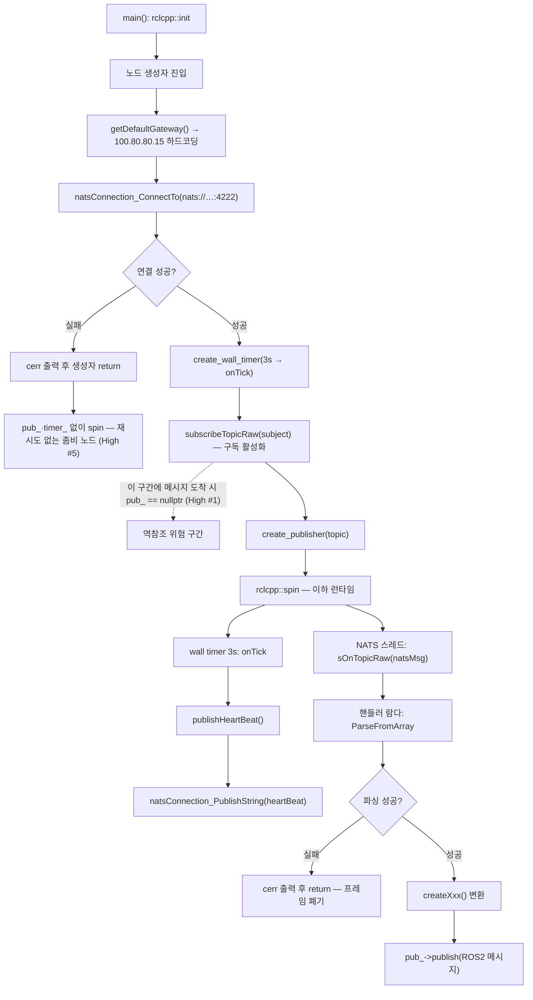

## 2026-08-15 (KST) — dss_ros2_bridge 리뷰

### 코드 버전

- 비-git 저장소(`git rev-parse` 실패) → **파일 내용 해시(SHA256, 앞 16자리)** 로 리뷰 대상을 고정한다.
- 직전 리뷰: 없음 (최초 리뷰 — delta 아님, Core 5항목 전체 작성)
- 같은 시각 SW 구조 분석: `docs/sw_structure/dss_ros2_bridge/2026-08-15.md` (인벤토리 공유)

| 파일 | 파일 내용 해시 | 파일 | 파일 내용 해시 |
| --- | --- | --- | --- |
| src/DSSToROSImage.cpp | `7486c1cb00a1a1e9` | src/DSSToROSGps.cpp | `ffc2a18ed3f2c9a8` |
| src/DSSToROSStereoCameraColor.cpp | `995575f5b8f92222` | src/DSSToROSClock.cpp | `d0d42c35a7396c59` |
| src/DSSToROSStereoCameraDepth.cpp | `6d1276cffb4bc0b5` | src/DSSDemo.cpp | `aca8eab59867a3ba` |
| src/DSSToROSStereoCameraInfra1.cpp | `8f44af9b7a31499c` | src/DSS.VSSClient.cpp | `a6e7796ecb16cf26` |
| src/DSSToROSStereoCameraInfra2.cpp | `9a55b60bf921af59` | src/DSS.VSSClient.h | `7ce386ba4e65ef0b` |
| src/DSSToROSIMU.cpp | `394728fc462c0451` | src/defaultGateway.cpp | `7fc807a40ad4782c` |
| src/DSSToROSPointCloud.cpp | `e185ffca2e3bdf8c` | CMakeLists.txt | `7c2123d2233f594c` |
| launch/launch.py | `30d0ee6ecc8042f7` | package.xml | `a7922201a5cf5e3a` |
| launch/demo.py | `b0354146f725da2f` | msg/DssControl.msg | `cf474df7b4a24894` |

### 분석 분기 명시

- 분기: **전체 구조 분석** (패키지 전체 · 실행 타깃 10개 · 다중 진입점)
- 감지된 도메인: ros2-review / concurrency
  - ros2-review 트리거: `package.xml`, `rclcpp`, `launch/*.py`, `ament_cmake`
  - concurrency 트리거: `std::thread`(DSS.VSSClient.cpp:119), `std::mutex`(:16), NATS 라이브러리 콜백 스레드
  - embedded-review: 해당 없음 (ISR·RTOS API 없음)
- 리뷰 제외: `src/dss.pb.h` · `src/dss.pb.cc` (protoc 생성물 — 원본은 `proto/dss.proto`)

---

## Core 인벤토리

### 1. 목적

DSS(Unreal 기반 차량 시뮬레이터)와 ROS 2 Humble 사이의 **단방향 센서 브리지 + 단방향 제어 브리지**다. DSS 가 NATS 메시지 버스로 내보내는 protobuf 센서 스트림을 구독해 대응하는 ROS 2 표준 메시지로 변환·발행하고(센서 방향), 반대로 ROS 2 측 제어값을 protobuf 로 직렬화해 UDP 로 DSS 에 보낸다(제어 방향). `README.md:1-3` 가 "Ubuntu 22.04 / WSL2 + ROS 2 Humble" 환경을 전제로 명시한다.

구조적으로는 **한 센서당 한 실행 파일**이다. 브리지 노드 9개(`DSSToROS*Node`)가 각각 별도 프로세스로 뜨고, 각자 NATS 에 독립 연결해 subject 하나를 구독한 뒤 ROS 토픽 하나를 발행한다(`launch/launch.py` 가 9개를 한 번에 기동). 노드 사이의 코드 공유는 `getDefaultGateway()` 하나뿐이며, 나머지 골격(NATS 연결 관리·구독 등록·heartbeat)은 9개 파일이 각자 복제해 갖는다.

제어 경로는 `DSSDemoNode` 하나뿐이며 `DSSVssClient` 싱글톤을 경유한다. 이 클라이언트는 NATS request/reply 기반 VSS(Vehicle Signal Specification) `get`/`set`/`action` API 와 UDP 기반 주행 제어(`setDriveControl`) 두 가지를 제공하지만, 현재 `DSSDemo.cpp` 에서 실제로 쓰이는 것은 `setDriveControl(0,0,0)` 뿐이고 VSS API 호출부는 전부 주석 처리되어 있다(`DSSDemo.cpp:34-99`).

### 2. 코드 플로우차트

진입점이 10개이고 성격이 2계열(센서 브리지 9 / 제어 데모 1)로 갈리므로 **path 별로 분리**한다(다중 진입점 분리 룰). 동반 drawio: [`2026-08-15-flow.drawio`](2026-08-15-flow.drawio)

#### 흐름 A — 센서 브리지 노드 (9개 공통 골격, `DSSToROSImageNode` 대표)



#### 흐름 B — 제어 데모 노드 (`DSSDemoNode`)

```mermaid
flowchart TB
    b1["main(): rclcpp::init"] --> b2["DssDemoController 생성자 진입"]
    b2 --> b3["DSSVssClient::singleton()"]
    b3 --> b4["(최초 1회) 생성자가 start(172.25.96.1) 자동 호출"]
    b4 --> b5["NATS connect(4222) + UDP socket(8886)"]
    b5 --> b6["vss.start(100.80.80.15, 8886, 4222)"]
    b6 --> b7{"conn == nullptr ?"}
    b7 -. 아니오 .-> n1["NATS_ERR 반환 · IP 재설정 무시 · 반환값 폐기 (High #4)"]
    b7 -- 예 --> b8["create_subscription ×3 (imu / lidar / rgb)"]
    b8 -. .-> n2["/dss/sensor/lidar 는 발행자 없음 — 고아 구독 (Medium #1)"]
    b8 --> b9["create_wall_timer(20ms)"]
    b9 --> b10["rclcpp::spin — 이하 런타임"]
    b10 --> b11["타이머 콜백: setDriveControl(0,0,0)"]
    b11 --> b12["dss::DssSetControl 직렬화"]
    b12 --> b13["sendto() — UDP 8886 로 송신"]
```

#### 공통 호출 그래프

두 path 가 공유하는 유일한 코드는 `getDefaultGateway()` 이며, 흐름 B 에서는 그것마저 `DSSVssClient::start()` 의 기본 인자에 밀려 실제로 쓰이지 않는다(High #4 참조).

### 3. 함수 리스트

전수 나열한다. **9개 브리지 노드가 바이트 단위로 동일한 골격 함수**는 한 행으로 묶고 위치 컬럼에 전 발생 지점을 적는다(중복 자체가 결함 항목 High #8 이다). `<Node>` = 9개 브리지 노드 클래스명, `<file>` = 그 노드의 소스 파일.

| # | 함수 | 입력 | 출력 | 기능 | 위치 |
|---|------|------|------|------|------|
| 1 | `<Node>::<Node>` (생성자) | 없음 | — | 게이트웨이 조회 → NATS 연결 → 3초 타이머 등록 → subject 구독 → 퍼블리셔 생성 | Image:72 · Color:72 · Depth:72 · Infra1:72 · Infra2:72 · IMU:95 · PointCloud:275 · Gps:76 · Clock:55 |
| 2 | `<Node>::~<Node>` | 없음 | — | 구독 전량 파괴 → 연결 파괴 → `nats_Close()` | Image:98 · Color:98 · Depth:99 · Infra1:98 · Infra2:98 · IMU:122 · PointCloud:303 · Gps:108 · Clock:86 |
| 3 | `<Node>::sOnTopicRaw` (static) | `natsConnection*`, `natsSubscription*`, `natsMsg*`, `void* closure` | void | 핸들러 호출 + 예외 포획(cerr) + `natsMsg_Destroy` | Image:107 · Color:107 · Depth:108 · Infra1:107 · Infra2:107 · IMU:130 · PointCloud:311 · Gps:116 · Clock:94 |
| 4 | `<Node>::publishHeartBeat` | 없음 | void | `{timeStamp,status}` JSON 을 heartbeat subject 로 발행 | Image:119 · Color:119 · Depth:120 · Infra1:119 · Infra2:119 · IMU:141 · PointCloud:323 · Gps:127 · Clock:105 |
| 5 | `<Node>::getCurrentTimeISO8601` | 없음 | `std::string` | UTC ISO8601(ms) 문자열 생성 | Image:133 · Color:133 · Depth:134 · Infra1:133 · Infra2:133 · IMU:152 · PointCloud:337 · Gps:139 · Clock:117 |
| 6 | `<Node>::onTick` | 없음 | void | `publishHeartBeat()` 호출 | Image:148 · Color:148 · Depth:149 · Infra1:148 · Infra2:148 · IMU:164 · PointCloud:350 · Gps:153 · Clock:131 |
| 7 | `<Node>::subscribeTopicRaw` (private) | `subject`, `TopicHandler`, `queue=nullptr` | bool | 핸들러·ctx 를 수명 컨테이너에 넣고 NATS 구독 등록 | Image:154 · Color:154 · Depth:155 · Infra1:154 · Infra2:154 · IMU:169 · PointCloud:356 · Gps:158 · Clock:142 |
| 7a | `<Node>::<Node>.구독핸들러람다` (inner) | `subject`, `const char* bytes`, `int len` | void | protobuf 파싱 → 변환 함수 → `pub_->publish` | Image:83 · Color:83 · Depth:84 · Infra1:83 · Infra2:83 · IMU:108 · PointCloud:288 · Gps:93 · Clock:66 |
| 8 | `<ImageNode>::createImage` (5개 노드 동일 코드) | `dss::DSSImage&` | `sensor_msgs::msg::Image` | JPEG 디코드 → BGR2RGB → `rgb8` 채우기, stamp 는 DSS 초 단위 → ns | Image:30 · Color:30 · Depth:30 · Infra1:30 · Infra2:30 |
| 9 | `DSSToROSIMUNode::createImu` | `const dss::DSSIMU&` | `sensor_msgs::msg::Imu` | orientation(없으면 단위 쿼터니언)·각속도·선가속도 채우기, covariance[0]=-1 | src/DSSToROSIMU.cpp:41 |
| 10 | `DSSToROSPointCloudNode::createPointCloud` | `const dss::DssLidarPointCloud&` | `sensor_msgs::msg::PointCloud2` | step 16/8/10/14 분기 디코드 → x,y,z,intensity 4필드. **호출부 없음(dead)** | src/DSSToROSPointCloud.cpp:38 |
| 11 | `DSSToROSPointCloudNode::dequantize` | `int16_t`, `float MaxAbs` | float | `v/32767*MaxAbs` 역양자화 | src/DSSToROSPointCloud.cpp:159 |
| 12 | `DSSToROSPointCloudNode::createPointCloud2` | `const dss::DssLidarPointCloud&` | `sensor_msgs::msg::PointCloud2` | x,y,z,intensity,ring,time 6필드(LIO-SAM 형식) 디코드 | src/DSSToROSPointCloud.cpp:165 |
| 13 | `DSSToROSGpsNode::CreateGPSTopic` | `const dss::DSSGPS&` | `sensor_msgs::msg::NavSatFix` | status·위경도·고도·covariance(9개일 때만) 채우기 | src/DSSToROSGps.cpp:38 |
| 14 | `DSSToROSClockNode::createClock` | `const dss::DssOneFrameFixedRateResult&` | `rosgraph_msgs::msg::Clock` | `frame_count × 5ms` 로 sim time 산출 | src/DSSToROSClock.cpp:40 |
| 15 | `main` (10개 타깃 공통) | `argc`, `argv` | int | `init` → `spin(make_shared<Node>())` → `shutdown` | Image:179 · Color:179 · Depth:180 · Infra1:179 · Infra2:179 · IMU:193 · PointCloud:380 · Gps:182 · Clock:166 · Demo:122 |
| 16 | `DSSVssClient::singleton` (static) | 없음 | `DSSVssClient&` | 함수 로컬 static 인스턴스 반환(최초 호출 시 생성자 실행) | src/DSS.VSSClient.cpp:27 |
| 17 | `DSSVssClient::DSSVssClient` (private 생성자) | 없음 | — | `start()` 를 **기본 인자로** 호출(반환값 폐기) | src/DSS.VSSClient.cpp:20 |
| 18 | `DSSVssClient::~DSSVssClient` | 없음 | — | `stop()` 호출 | src/DSS.VSSClient.cpp:23 |
| 19 | `DSSVssClient::start` | `ip="172.25.96.1"`, `drivePort=8886`, `vssPort=4222` | `natsStatus` | NATS 옵션·연결 생성 + UDP 소켓·주소 준비. `conn != nullptr` 이면 즉시 `NATS_ERR` | src/DSS.VSSClient.cpp:32 |
| 20 | `DSSVssClient::stop` | 없음 | void | 전역 구독 맵 2개 정리 → UDP close → 연결·옵션 파괴 → `nats_Close()` | src/DSS.VSSClient.cpp:78 |
| 21 | `DSSVssClient::requestAsync` (private) | `subject`, `payload`, `OnReply`, `timeoutMs` | void | detached 스레드에서 `natsConnection_RequestString` 수행 후 콜백 | src/DSS.VSSClient.cpp:117 |
| 21a | `requestAsync.스레드람다` (inner) | 캡처: `this`,`subject`,`payload`,`onReply`,`timeoutMs` | void | 동기 request 수행 → 응답 문자열로 콜백 | src/DSS.VSSClient.cpp:119 |
| 22 | `DSSVssClient::setDriveControl` | `throttle`, `steer`, `brake` | void | `dss::DssSetControl` 직렬화 후 UDP `sendto` | src/DSS.VSSClient.cpp:149 |
| 23 | `DSSVssClient::get` | `vssName`, `OnReply`, `timeoutMs=1000` | void | `{"VSSName":…}` JSON 을 `VSS.Get` 으로 request | src/DSS.VSSClient.cpp:175 |
| 24 | `DSSVssClient::set` | `vssName`, `value`, `OnResult`, `timeoutMs=1000` | void | `{"VSSName":…,"Value":…}` 를 `VSS.Set` 으로 request | src/DSS.VSSClient.cpp:183 |
| 24a | `set.응답래핑람다` (inner) | `natsStatus`, `const std::string&` | void | 상태만 뽑아 `onResult` 호출 | src/DSS.VSSClient.cpp:192 |
| 25 | `DSSVssClient::action` | `vssName`, `value`, `OnReply`, `timeoutMs=2000` | void | 같은 JSON 을 `VSS.Act` 로 request | src/DSS.VSSClient.cpp:199 |
| 26 | `DSSVssClient::natsMsgThunk` (static) | NATS 콜백 4인자 | void | closure 를 `OnMessage*` 로 캐스팅해 문자열 페이로드 전달 | src/DSS.VSSClient.cpp:214 |
| 27 | `DSSVssClient::natsRawMsgThunk` (static) | NATS 콜백 4인자 | void | closure 를 캐스팅해 바이트 벡터 페이로드 전달 | src/DSS.VSSClient.cpp:234 |
| 28 | `DSSVssClient::subscribe` (OnMessage 오버로드) | `subject`, `OnMessage`, `natsStatus* out` | `natsSubscription*` | 문자열 콜백 구독 등록, closure 를 전역 맵에 보관 | src/DSS.VSSClient.cpp:261 |
| 29 | `DSSVssClient::subscribe` (OnRawMessage 오버로드) | `subject`, `OnRawMessage`, `natsStatus* out` | `natsSubscription*` | 바이트 콜백 구독 등록 | src/DSS.VSSClient.cpp:297 |
| 30 | `DSSVssClient::subscribeSensor` | `subject`, `OnRawMessage`, `natsStatus* out` | `natsSubscription*` | **함수 #29 와 본문 완전 동일** | src/DSS.VSSClient.cpp:333 |
| 31 | `DSSVssClient::unsubscribe` (static, 헤더 inline) | `natsSubscription*&` | void | 구독 파괴 후 포인터 null 화(전역 맵 정리 없음) | src/DSS.VSSClient.h:40 |
| 32 | `DssDemoController::DssDemoController` | 없음 | — | VSS 싱글톤 기동 → ROS 구독 3개 → 20ms 제어 타이머 등록 | src/DSSDemo.cpp:10 |
| 32a | `DssDemoController.imu구독람다` (inner) | `sensor_msgs::msg::Imu::SharedPtr` | void | `last_imu_` 에 복사(이후 사용처 없음) | src/DSSDemo.cpp:20 |
| 32b | `DssDemoController.pointcloud구독람다` (inner) | `PointCloud2::SharedPtr` | void | `last_cloud_` 에 복사(이후 사용처 없음) | src/DSSDemo.cpp:25 |
| 32c | `DssDemoController.image구독람다` (inner) | `Image::SharedPtr` | void | `last_image_` 에 복사(이후 사용처 없음) | src/DSSDemo.cpp:29 |
| 32d | `DssDemoController.타이머람다` (inner) | 없음 | void | 매 20ms `setDriveControl(0,0,0)` 호출 | src/DSSDemo.cpp:103 |
| 33 | `getDefaultGateway` | 없음 | `std::string` | `"100.80.80.15"` 즉시 반환(`/proc/net/route` 파싱 구현은 주석) | src/defaultGateway.cpp:15 |
| 34 | `generate_launch_description` (launch 진입점) | 없음 | `LaunchDescription` | 브리지 노드 9개를 `use_sim_time=True` 로 기동 | launch/launch.py:4 |
| 35 | `generate_launch_description` (launch 진입점) | 없음 | `LaunchDescription` | `DSSDemoNode` 1개 기동 | launch/demo.py:4 |

**중복/유사 함수**: 함수 #1~#7·#7a 는 9벌, 함수 #8 은 5벌, 함수 #15 는 10벌이 동일 코드다. 함수 #29 와 #30 은 본문이 완전히 같다. 함수 #10 은 함수 #12 의 이전 세대로 보이며 호출부가 없다 → 통합·삭제 권고(High #8 · Medium #5 · Medium #6).

### 4. 전역 변수 / 모듈 상수

| # | 변수 | 사용처(함수) | 기능 | 위치 |
|---|------|--------------|------|------|
| 1 | `gSubMx` (가변) | 함수 #20·#28·#29·#30 | 아래 두 맵을 보호하는 뮤텍스. 익명 네임스페이스 파일 스코프 | src/DSS.VSSClient.cpp:16 |
| 2 | `gClosures` (가변) | 함수 #20·#28 | `natsSubscription* → OnMessage*` 소유 맵 | src/DSS.VSSClient.cpp:17 |
| 3 | `gRawClosures` (가변) | 함수 #20·#29·#30 | `natsSubscription* → OnRawMessage*` 소유 맵 | src/DSS.VSSClient.cpp:18 |
| 4 | `DSSVssClient::conn` (가변, 인스턴스지만 싱글톤이라 사실상 전역) | 함수 #19·#20·#21a·#28·#29·#30 | NATS 연결 핸들 | src/DSS.VSSClient.h:63 |
| 5 | `DSSVssClient::udp_socket_`, `dss_addr_` (가변, 〃) | 함수 #19·#20·#22 | 제어용 UDP 소켓·목적지 주소 | src/DSS.VSSClient.h:65-66 |
| 6 | `singleton()` 의 `static DSSVssClient s` (가변) | 함수 #16 | 함수 로컬 static — 프로그램 수명 인스턴스 | src/DSS.VSSClient.cpp:28 |
| 7 | `MAX_SUBS` (상수, 매크로 64) | 함수 #7 | 노드당 최대 구독 수. **9개 파일이 각자 정의** | Image:9 · Color:9 · Depth:9 · Infra1:9 · Infra2:9 · IMU:17 · PointCloud:10 · Gps:13 · Clock:12 |
| 8 | `json` (상수, 타입 별칭) | 함수 #4 | `nlohmann::json` 별칭. **9개 파일이 각자 정의** | Image:8 외 8곳 |
| 9 | `DT_NS` (상수, 함수 로컬 `constexpr` 5'000'000ns) | 함수 #14 | sim time 델타 하드코딩 값 | src/DSSToROSClock.cpp:43 |

**필요성 평가**: #1~#3 은 `DSSVssClient` 인스턴스 상태여야 할 것이 파일 스코프 전역으로 나가 있다. 싱글톤이라 현재는 동작하지만, 클래스 멤버(+ 인스턴스 뮤텍스)로 옮기면 전역 가변 상태 3개가 사라지고 구독 해제 누락(High #7)도 구조적으로 막힌다 → `[품질]`. #7·#8 은 9벌 중복이며 공용 헤더 1곳으로 충분하다 → `[품질]`(High #8 에 포함). #4·#5 는 비보호 공유 상태다(Medium #14, B-2 표 참조).

### 5. 의존성 3-tier

| Tier | 대상 | 버전/제약 | 부재 시 동작(필수/선택) | 근거(파일:line) |
| --- | --- | --- | --- | --- |
| 빌드 | `ament_cmake` | — | 빌드 불가 | package.xml:12 · CMakeLists.txt:12 |
| 빌드 | `rclcpp` | — | 빌드 불가 | package.xml:15 · CMakeLists.txt:13 |
| 빌드 | `rosidl_default_generators` / `rosidl_default_runtime` | — | `DssControl.msg` 생성 불가 | package.xml:19,22 · CMakeLists.txt:26 |
| 빌드 | `sensor_msgs` | — | **빌드 불가. package.xml 에 선언 없음** → `rosdep install` 로 설치되지 않음 | CMakeLists.txt:17 (package.xml 누락) |
| 빌드 | `rosgraph_msgs` | — | **Clock 노드 빌드 불가. `find_package`·`ament_target_dependencies`·package.xml 모두 선언 없음** — 현재는 `rclcpp` 의 전이 include 경로로 우연히 성공 | DSSToROSClock.cpp:5 (선언 0곳) |
| 빌드 | `OpenCV` | — | **빌드 불가. package.xml 선언 없음** | CMakeLists.txt:22 |
| 빌드 | `Protobuf` | `3.15` 고정, `Protobuf_DIR=/usr/local/lib/cmake/protobuf` 하드코딩 | **해당 절대경로에 3.15 가 없으면 빌드 불가.** package.xml 선언 없음 | CMakeLists.txt:9,23 |
| 빌드 | `cnats` (`libnats`) | `find_library` (REQUIRED 아님) | 못 찾으면 `NATS_LIB-NOTFOUND` 로 **링크 단계에서** 실패(원인 불명확). package.xml 선언 없음 | CMakeLists.txt:29 |
| 빌드 | `nlohmann/json` | 헤더 온리 | **`find_package` 없음** — 시스템 include 경로에 없으면 빌드 불가. package.xml 선언 없음 | Image:7 외 8곳 |
| 빌드 | `Threads::Threads` | — | **`find_package(Threads)` 없음** — 타깃 미정의 시 CMake 구성 실패. 현재는 전이 정의에 의존 | CMakeLists.txt:50 외 9곳 |
| 빌드 (미사용) | `rclpy`, `cv_bridge`, `std_msgs`, `geometry_msgs`, `nav_msgs`, `visualization_msgs` | REQUIRED | 없으면 구성 실패하나 **코드에서 전혀 쓰지 않음** | CMakeLists.txt:14-20 |
| 런타임 필수 | NATS 서버 `100.80.80.15:4222` | — | **각 노드가 cerr 한 줄 출력 후 생성자 조기 return → 퍼블리셔·타이머 없이 spin. 재연결 시도 없음.** 프로세스는 살아 있어 외형상 정상으로 오인됨 (High #5) | 함수 #1 (Image:75-79 외 8곳) |
| 런타임 필수 | DSS 시뮬레이터 sim clock 발행(`dss.simTime.clock`) | — | `/clock` 이 발행되지 않고, `use_sim_time=True` 인 모든 노드의 ROS 시간이 0 에 정지 | launch.py:8 · Clock:65,81 |
| 런타임 필수 | DSS 제어 수신 UDP `100.80.80.15:8886` (또는 `172.25.96.1:8886`) | — | UDP 비연결형이라 **오류가 보고되지 않음** — `sendto` 는 성공을 반환하고 제어만 조용히 유실 | 함수 #22 (DSS.VSSClient.cpp:166) |
| 런타임 선택 | 없음 | — | fallback 이 정의된 의존성이 하나도 없다 | — |

---

## 도메인 — ros2-review

### A-1. Subscriptions

| 토픽 | 메시지 타입 | QoS(depth·reliability·durability·history) | 콜백 함수 | 위치(file:line) |
| --- | --- | --- | --- | --- |
| /dss/sensor/imu | sensor_msgs/Imu | 10 · RELIABLE · VOLATILE · KEEP_LAST (기본) | 함수 #32a | src/DSSDemo.cpp:19 |
| /dss/sensor/lidar | sensor_msgs/PointCloud2 | 10 · RELIABLE · VOLATILE · KEEP_LAST (기본) | 함수 #32b | src/DSSDemo.cpp:23 |
| /dss/sensor/camera/rgb | sensor_msgs/Image | 10 · RELIABLE · VOLATILE · KEEP_LAST (기본) | 함수 #32c | src/DSSDemo.cpp:28 |

### A-2. Publications

| 토픽 | 메시지 타입 | QoS | 발행 위치(함수) | 위치(file:line) |
| --- | --- | --- | --- | --- |
| /dss/sensor/camera/rgb | sensor_msgs/Image | 10 · RELIABLE · VOLATILE | 함수 #7a → #8 | src/DSSToROSImage.cpp:94 |
| /dss/sensor/camera/color/image_raw | sensor_msgs/Image | 10 · RELIABLE · VOLATILE | 함수 #7a → #8 | src/DSSToROSStereoCameraColor.cpp:94 |
| /dss/sensor/camera/depth/image_raw | sensor_msgs/Image | 10 · RELIABLE · VOLATILE | 함수 #7a → #8 | src/DSSToROSStereoCameraDepth.cpp:95 |
| /dss/sensor/camera/infra1/image_raw | sensor_msgs/Image | 10 · RELIABLE · VOLATILE | 함수 #7a → #8 | src/DSSToROSStereoCameraInfra1.cpp:94 |
| /dss/sensor/camera/infra2/image_raw | sensor_msgs/Image | 10 · RELIABLE · VOLATILE | 함수 #7a → #8 | src/DSSToROSStereoCameraInfra2.cpp:94 |
| /dss/sensor/imu | sensor_msgs/Imu | 10 · RELIABLE · VOLATILE | 함수 #7a → #9 | src/DSSToROSIMU.cpp:118 |
| /dss/sensor/lidar3d | sensor_msgs/PointCloud2 | 10 · RELIABLE · VOLATILE | 함수 #7a → #12 | src/DSSToROSPointCloud.cpp:299 |
| /dss/sensor/gps/fix | sensor_msgs/NavSatFix | 10 · RELIABLE · VOLATILE | 함수 #7a → #13 | src/DSSToROSGps.cpp:103 |
| /clock | rosgraph_msgs/Clock | 10 · RELIABLE · VOLATILE | 함수 #7a → #14 | src/DSSToROSClock.cpp:81 |

### A-3. Services / Actions

| 이름 | 타입 | 클라이언트/서버 | 콜백/요청 위치 | 위치(file:line) |
| --- | --- | --- | --- | --- |
| (없음) | — | — | — | — |

ROS2 서비스·액션은 하나도 없다. 요청/응답 패턴은 ROS2 밖에서 NATS request/reply 로 구현되어 있다(함수 #21·#23·#24·#25 — subject `VSS.Get` / `VSS.Set` / `VSS.Act`).

### A-4. Parameters

| 이름 | 타입 | default | declare 위치 | 사용 위치 |
| --- | --- | --- | --- | --- |
| `use_sim_time` | bool | `True` (launch 에서 주입, rclcpp 내장이라 declare 불요) | launch/launch.py:8 · launch/demo.py:8 | 함수 #7a (src/DSSToROSClock.cpp:74) |
| `nats_server` / `dss_server` / `dss_port` / `nats_port` | string / int | — | **전부 주석 처리** | launch.py:9-12 · Gps:81-82 · PointCloud:276-277 |

선언된 파라미터가 `use_sim_time` 하나뿐이고, 그마저 9개 노드 중 Clock 노드만 읽는다. 서버 주소·포트는 파라미터화 코드가 작성됐다가 전부 주석 처리되어 지금은 하드코딩 경로만 살아 있다(함수 #33).

파라미터화할 경우의 권고 형태 — 의미 그룹별 분리 + 단위 주석:

```yaml
dss_to_ros_image_node:
  ros__parameters:
    # 의미 그룹 1 (DSS 접속)
    nats_host: "100.80.80.15"     # IPv4, DSS 호스트
    nats_port: 4222               # TCP 포트
    drive_udp_port: 8886          # UDP 포트 (제어 송신)
    # 의미 그룹 2 (타이밍)
    heartbeat_period: 3.0         # s, heartbeat 발행 주기
    control_rate_hz: 50.0         # Hz, 제어 송신 주기 (현재 코드 20 ms)
    # 의미 그룹 3 (시간 축)
    sim_delta: 0.005              # s, DSS 고정 프레임 델타 (함수 #14 하드코딩 값)
```

### A-5. TF frames

| frame | parent | 발행 노드 | 정적/동적 | 위치 |
| --- | --- | --- | --- | --- |
| `camera` | (없음 — TF 미발행) | Image·StereoColor·StereoDepth·Infra1·Infra2 5개 노드가 **동일 이름 사용** | — | 함수 #8 (Image:55 외 4곳) |
| `imu_link` | (없음) | DSSToROSIMUNode | — | 함수 #9 (IMU:49) |
| `lidar_link` | (없음) | DSSToROSPointCloudNode | — | 함수 #12 (PointCloud:181) |
| `map` | (없음) | (함수 #10 에만 존재 — dead code) | — | PointCloud:58 |
| DSS 원본 문자열 | (없음) | DSSToROSGpsNode (`dss_gps.header().frame_id()` 그대로 전달) | — | 함수 #13 (Gps:45) |

TF 브로드캐스터가 하나도 없다. frame_id 는 채우지만 프레임 간 변환은 이 패키지 밖에서 공급해야 한다(URDF/robot_state_publisher 등 외부 의존).

### A-6. QoS 호환 매트릭스 (RxO — Requested vs Offered)

| 토픽 | pub(offered) | sub(requested) | Reliability | Durability | 판정 |
| --- | --- | --- | --- | --- | --- |
| /dss/sensor/imu | RELIABLE·VOLATILE·10 | RELIABLE·VOLATILE·10 | OK | OK | ✅ 연결 |
| /dss/sensor/camera/rgb | RELIABLE·VOLATILE·10 | RELIABLE·VOLATILE·10 | OK | OK | ✅ 연결 |
| /dss/sensor/lidar | **발행자 없음** | RELIABLE·VOLATILE·10 | — | — | ❌ 미연결 (고아 구독) |
| /dss/sensor/lidar3d | RELIABLE·VOLATILE·10 | (패키지 내 구독자 없음) | — | — | ⚠ 외부 소비자 전제 |
| 나머지 이미지 4종·gps/fix·/clock | RELIABLE·VOLATILE·10 | (패키지 내 구독자 없음) | — | — | ⚠ 외부 소비자 전제 |

RxO 축 자체는 pub/sub 이 동일 프로파일이라 불일치가 없다(`BEST_EFFORT`→`RELIABLE`, `VOLATILE`→`TRANSIENT_LOCAL` 같은 미연결 조합 없음). 문제는 호환성이 아니라 **프로파일 선택**이다 — 대용량 이미지·포인트클라우드를 `RELIABLE`·depth 10 으로 보내면 소비자가 느릴 때 재전송·큐 적체로 지연이 누적된다(Medium #11).

### A-7. 노드 연결 그래프 (rqt_graph 등가)

| 토픽 | 발행 노드 | 구독 노드(들) | 메시지 타입 | QoS 호환(A-6) |
| --- | --- | --- | --- | --- |
| /dss/sensor/camera/rgb | DSSToROSImageNode | DSSDemoNode | sensor_msgs/Image | ✅ |
| /dss/sensor/imu | DSSToROSIMUNode | DSSDemoNode | sensor_msgs/Imu | ✅ |
| /dss/sensor/lidar | **(없음)** | DSSDemoNode | sensor_msgs/PointCloud2 | ❌ 미연결 |
| /dss/sensor/lidar3d | DSSToROSPointCloudNode | (패키지 밖) | sensor_msgs/PointCloud2 | ⚠ |
| /dss/sensor/camera/color/image_raw | DSSToROSStereoCameraColorNode | (패키지 밖) | sensor_msgs/Image | ⚠ |
| /dss/sensor/camera/depth/image_raw | DSSToROSStereoCameraDepthNode | (패키지 밖) | sensor_msgs/Image | ⚠ |
| /dss/sensor/camera/infra1/image_raw | DSSToROSStereoCameraInfra1Node | (패키지 밖) | sensor_msgs/Image | ⚠ |
| /dss/sensor/camera/infra2/image_raw | DSSToROSStereoCameraInfra2Node | (패키지 밖) | sensor_msgs/Image | ⚠ |
| /dss/sensor/gps/fix | DSSToROSGpsNode | (패키지 밖) | sensor_msgs/NavSatFix | ⚠ |
| /clock | DSSToROSClockNode | 전 노드(use_sim_time=True, rclcpp 내부 구독) | rosgraph_msgs/Clock | ✅ |

```text
[DSS 시뮬레이터] --NATS--> /DSSToROSImageNode      --[/dss/sensor/camera/rgb]--> /DSSDemoNode
[DSS 시뮬레이터] --NATS--> /DSSToROSIMUNode        --[/dss/sensor/imu]--------> /DSSDemoNode
[DSS 시뮬레이터] --NATS--> /DSSToROSPointCloudNode --[/dss/sensor/lidar3d]----> (외부)
                                                    /dss/sensor/lidar  <------- /DSSDemoNode (발행자 없음)
[DSS 시뮬레이터] --NATS--> /DSSToROSClockNode      --[/clock]----------------> (전 노드)
/DSSDemoNode --UDP 8886--> [DSS 시뮬레이터]
```

점검 결과 — **고아 토픽**: `/dss/sensor/lidar` 는 구독만 존재(Medium #1). 발행 전용 6종은 패키지 밖 소비자를 전제하므로 고아로 단정하지 않고 외부 경계로 표기한다. **다중 발행자**: 없음(코드상 토픽당 pub 1개). **외부 경계**: DSS 시뮬레이터(NATS 4222 / UDP 8886) — 의존성 3-tier 런타임 필수 행과 대응.

### A-8. 기동 절차 (bringup)

| 단계 | 런치/명령 | 띄우는 노드 | 순서 의존(선행 단계) | 절차서 위치(파일:줄) |
| --- | --- | --- | --- | --- |
| 1 | (패키지 밖) DSS 시뮬레이터 + NATS 서버 기동 | — | 없음 | 절차서 없음 |
| 2 | `colcon build --symlink-install` | — | 1 무관 | README.md:96-102 |
| 3 | `source ./install/setup.bash` | — | 2 | README.md:110 |
| 4 | `ros2 launch dss_ros2_bridge launch.py` | 브리지 9개(Image·StereoColor·StereoDepth·StereoInfra1·StereoInfra2·IMU·PointCloud·GPS·Clock) | 1(NATS 미기동 시 좀비, High #5), 3 | README.md:111 · launch/launch.py |
| 5 | `ros2 launch dss_ros2_bridge demo.py` | DSSDemoNode | 4(구독 대상 토픽 필요) | launch/demo.py (README 미기재) |

**본 리뷰에는 실측 수치가 없다** — 정적 코드 리뷰만 수행했고 Hz·지연·발행자 수를 측정하지 않았다. 따라서 A-8 은 절차 확인용이며, 성능 관련 지적(Medium #11·#12)은 코드 구조 근거의 위험 지적이지 측정 결과가 아니다. 절차서 결함: 4단계가 1단계에 의존한다는 사실과 5단계 자체가 README 에 없다.

---

## 도메인 — concurrency

### B-1. 동기화 객체

| 객체 | 종류(Mutex/Lock/Event/Semaphore/Atomic/Condvar) | 보호 자원 | 획득 위치 | 해제 위치 |
| --- | --- | --- | --- | --- |
| `gSubMx` | `std::mutex` (`lock_guard` RAII) | 전역 #2 `gClosures`, 전역 #3 `gRawClosures` | DSS.VSSClient.cpp:81 · :90 · :285 · :321 · :357 | 각 `lock_guard` scope 종료(같은 줄 블록 끝) |

동기화 객체는 이 하나뿐이다. 아래 B-2 의 비보호 항목들에는 대응 객체가 없다.

### B-2. 공유 상태

| 변수 | 읽기 위치 | 쓰기 위치 | 변경 방식 | 공유 방식 | 보호 객체 |
| --- | --- | --- | --- | --- | --- |
| `gClosures` (전역 #2) | DSS.VSSClient.cpp:82 | :86, :84(erase 계열 clear :87) | 컬렉션 변형(삽입·전체 삭제) | 전역 객체 | `gSubMx` |
| `gRawClosures` (전역 #3) | :91 | :322, :358, clear :95 | 컬렉션 변형 | 전역 객체 | `gSubMx` |
| `conn` (전역 #4) | :120(detached 스레드) · :264 · :299 · :335 · :106 | :51(생성자 스레드), :105(nullptr 대입) | check-then-act (**비원자적 read-modify-write** — `if (conn != nullptr) return NATS_ERR` 후 대입) | 싱글톤 멤버 | **비보호** |
| `udp_socket_`, `dss_addr_` (전역 #5) | :151, :166 (ROS 타이머 콜백 스레드) | :61, :65-68 (생성자 스레드), :99-100 (소멸 스레드) | 단순 대입 + check-then-act(`if (udp_socket_ < 0)` 후 `sendto`) | 싱글톤 멤버 | **비보호** |
| `<Node>::pub_` | 함수 #7a (NATS 콜백 스레드) — Image:90 외 8곳 | 함수 #1 (주 스레드) — Image:94 외 8곳 | 단순 대입(`shared_ptr` 교체) | 노드 멤버 | **비보호** — 게다가 쓰기가 구독 등록보다 **뒤**라 초기 null 창이 존재 (High #1) |
| `<Node>::nats_.subs[]`, `nats_.count` | 함수 #2 (소멸) | 함수 #7 (생성자 스레드) | `count++` (**비원자적 복합 연산**) | 노드 멤버 | 비보호 (현재는 생성자에서만 호출되어 단일 스레드 — 런타임 구독 추가 시 즉시 race) |
| `DssDemoController::last_imu_/last_cloud_/last_image_` | (읽는 곳 없음) | 함수 #32a~#32c (executor 스레드) | 단순 대입(메시지 전체 복사) | 노드 멤버 | 비보호 (읽는 쪽이 없어 현재 무해) |

### B-3. 실행 컨텍스트

| 이름 | 종류(thread/task/coroutine/callback group/executor) | 우선순위·executor | 생성 위치 |
| --- | --- | --- | --- |
| 주 스레드 | executor | `rclcpp::spin` 기본 **SingleThreadedExecutor**, 콜백 그룹 지정 없음(전부 기본 MutuallyExclusive) | 함수 #15 |
| NATS delivery 스레드 | thread (cnats 라이브러리 내부) | 라이브러리 관리, ROS executor 밖 | `natsConnection_Subscribe` 등록 시점 — 함수 #7 |
| ROS wall timer 콜백 | task (executor 위) | 주 스레드 executor, 3초 주기(브리지) / 20ms(데모) | 함수 #1 (Image:81 외) · 함수 #32 (Demo:103) |
| VSS request 스레드 | thread (`std::thread(...).detach()`) | **요청 1건당 1개 생성·detach**, 소유자 없음 | 함수 #21 (DSS.VSSClient.cpp:119,145) |

**핵심**: 변환·발행이 ROS executor 가 아니라 **NATS delivery 스레드**에서 실행된다(함수 #3 → #7a → #8/#9/#12/#13/#14 → `pub_->publish`). 콜백 그룹·executor 설정으로 제어되지 않는 경로이므로 ROS2 쪽 동시성 도구가 이 구간에 전혀 적용되지 않는다.

---

## 평가

severity 분포: Critical 1 / High 8 / Medium 16 / Low 8 / Info 3
Verdict: REQUEST CHANGES

> 본 리뷰는 작성자 본인이 `APPROVE` 할 수 없다. 조치 후 별도 lane(다른 세션·리뷰어)에서 재리뷰가 필요하다.
> 상태 표기: 최초 리뷰이므로 전 항목 `[신규]`.

### Critical

**함수 #12 `createPointCloud2`(및 #10) — [논리][신규] 원격 입력 필드를 검증 없이 포인터 산술에 사용 → 힙 버퍼 오버리드 (Critical)**
   재현: src/DSSToROSPointCloud.cpp:169-171,236-243. `num_points = pcd_msg.width()`, `step = pcd_msg.point_step()`, `raw = pcd_msg.data().data()` 는 전부 **NATS 로 수신한 protobuf 메시지의 필드**다. 세 값의 정합성(`data().size() >= num_points * step`)을 검증하지 않고 `raw + i*step` 에서 14바이트를 읽는다. `width` 가 크거나 `point_step` 이 실제 레이아웃보다 크면 `data` 버퍼 밖을 읽는다. 추가로 `modifier.resize(num_points)`(:218)가 `num_points × 20` 바이트를 즉시 할당하므로 `width` 조작만으로 대량 할당·`bad_alloc` 도 유발된다. 함수 #10 도 동일 구조(:90-92).
   권고: 변환 진입부에 `if (step < 14 || pcd_msg.data().size() < static_cast<size_t>(num_points) * step) { 로그 후 폐기; }` 가드 추가. `num_points` 상한(예: 센서 최대 포인트 수)도 함께 검사. `step` 별 최소 바이트 수를 상수로 명시.

### High

**함수 #1·#7a — [race][논리][신규] 구독 등록이 퍼블리셔 생성보다 먼저 — `pub_` nullptr 역참조 (High)**
   재현: src/DSSToROSImage.cpp:82 에서 `subscribeTopicRaw` 로 NATS 구독이 **활성화**되고, `pub_` 은 :94 에서야 생성된다. 그 사이에 DSS 가 메시지를 보내면 NATS delivery 스레드가 함수 #7a 를 실행해 :90 `pub_->publish(...)` 를 호출하는데 `pub_` 은 아직 기본 생성된 빈 `shared_ptr` 이다 → null 역참조로 프로세스 종료. 9개 노드 전부 동일 순서(Clock:65 구독 → :81 생성). 카메라처럼 고빈도 스트림에서 창이 좁아도 재기동 시마다 확률적으로 발생한다.
   권고: `create_publisher` 를 `subscribeTopicRaw` **앞으로** 이동. 순서 이동만으로 해소되며 비용 0이다.

**함수 #23·#24·#25 `get`/`set`/`action` — [논리][신규] `sprintf` 로 고정 256바이트 스택 버퍼에 무제한 입력 기록 (High)**
   재현: src/DSS.VSSClient.cpp:177-180, :185-190, :201-206. `char json[256]` 에 `sprintf` 로 `vssName`·`value` 를 길이 검증 없이 넣는다. VSS 경로(`Vehicle.Cabin.Door.Row1.DriverSide.Switch` 등)는 길어지기 쉽고, `set`/`action` 은 사용자 값까지 받는다. 합계 240자를 넘으면 스택 오버플로다. 현재 호출부가 전부 주석 처리(DSSDemo.cpp:44-98)라 즉시 터지지는 않지만 public API 로 노출돼 있다.
   권고: `snprintf(json, sizeof(json), ...)` 로 교체하고 반환값으로 절단을 검사하거나, `nlohmann::json`(이미 의존 중)으로 조립해 `std::string` 을 쓴다.

**함수 #27 `natsRawMsgThunk` — [논리][신규] closure 를 실제 타입과 다른 시그니처로 `reinterpret_cast` (High)**
   재현: 함수 #29·#30 은 `new OnRawMessage(...)` 즉 `std::function<void(const std::string&, const std::vector<uint8_t>&)>*` 를 closure 로 넘긴다(:304, :340). 그런데 함수 #27 은 :240 에서 `reinterpret_cast<std::function<void(std::string, std::vector<uint8_t>)>*>` — **인자를 값으로 받는 다른 타입**으로 캐스팅한 뒤 `operator()` 를 호출한다(:250). 타입이 다른 객체를 통한 호출이므로 정의되지 않은 동작이다. 현재 구현체 레이아웃이 같아 우연히 동작할 뿐, 표준 라이브러리 구현·최적화 수준이 바뀌면 깨진다. 대비되는 함수 #26 은 올바르게 `OnMessage*` 로 캐스팅한다(:219).
   권고: `reinterpret_cast<DSSVssClient::OnRawMessage*>` 로 수정. 타입 별칭을 그대로 쓰면 재발하지 않는다.

**함수 #19·#32 — [논리][신규] `start()` 재호출이 무시되고 반환값도 폐기 → 의도와 다른 서버에 연결 (High)**
   재현: 함수 #17(생성자)이 이미 `start()` 를 **기본 인자**(`ip="172.25.96.1"`, DSS.VSSClient.h:24)로 호출해 연결을 만든다(:21). 이후 함수 #32 가 `vss.start("100.80.80.15", 8886, 4222)`(DSSDemo.cpp:16)를 호출하지만, 함수 #19 는 진입 즉시 `if (conn != nullptr) return NATS_ERR`(:33-34) 로 빠져나온다. 호출부는 반환값을 확인하지 않으므로 실패가 드러나지 않는다. 결과적으로 데모 노드의 VSS/UDP 는 `172.25.96.1` 로, 브리지 노드 9개는 `getDefaultGateway()` 가 주는 `100.80.80.15` 로 향한다 — **같은 패키지 안에서 두 개의 다른 서버 주소가 동시에 유효**하다.
   권고: 싱글톤 생성자에서 네트워크 연결을 하지 않고(지연 초기화), 최초 `start(...)` 호출이 실제 접속을 수행하도록 분리. 최소 조치로도 호출부에서 반환값을 검사하고 `NATS_ERR` 시 로그를 남겨야 한다.

**함수 #1 — [논리][runtime][신규] NATS 연결 실패 시 생성자 조기 return — 재시도 없는 좀비 노드 (High)**
   재현: src/DSSToROSImage.cpp:76-79 외 8곳. 연결 실패 시 `std::cerr` 한 줄 뒤 `return;` 이다. 생성자가 정상 종료되므로 함수 #15 는 그대로 `rclcpp::spin` 에 진입하고, 노드는 **퍼블리셔도 타이머도 구독도 없는 상태로 영원히 산다**. `ros2 node list` 에는 정상 등재되어 운영자는 브리지가 동작 중이라고 오인한다. 재연결 로직이 없어 NATS 가 나중에 떠도 복구되지 않는다.
   권고: 연결 실패를 예외로 올려 프로세스를 종료시키거나(compose/systemd 재기동에 위임), 재시도 타이머를 두고 `RCLCPP_ERROR` 로 주기 경고. 어느 쪽이든 "조용히 살아 있는" 상태만은 없애야 한다.

**의존성 3-tier 빌드 tier 전체 — [논리][신규] `package.xml` 이 실제 의존성의 대부분을 선언하지 않음 (High)**
   재현: package.xml 은 `rclcpp` + rosidl 만 선언한다(:15,:19,:22). 그러나 CMakeLists.txt 는 `sensor_msgs`(:17)·`OpenCV`(:22)·`Protobuf`(:23)를 요구하고, 코드는 `nlohmann/json`(Image:7)·`cnats`(:4)·`rosgraph_msgs`(Clock:5)를 추가로 쓴다. 결과: 깨끗한 머신에서 `rosdep install --from-paths src --ignore-src -y` 가 이 의존성들을 설치하지 못해 빌드가 실패하고, `colcon` 의 패키지 위상 정렬도 부정확해진다. `rosgraph_msgs` 는 `find_package` 조차 없어 `rclcpp` 의 전이 include 경로에 의존해 우연히 컴파일되는 상태다.
   권고: package.xml 에 `<depend>sensor_msgs</depend>`, `<depend>rosgraph_msgs</depend>`, `<depend>libopencv-dev</depend>`, `<depend>protobuf-dev</depend>`, `<depend>nlohmann-json-dev</depend>` 추가. `cnats` 는 rosdep 키가 없으므로 README 선행 설치 절차(README.md:52)를 package.xml 주석으로 연결. CMakeLists 에 `find_package(rosgraph_msgs REQUIRED)` 추가 후 `ament_target_dependencies` 에 등재.

**함수 #31 `unsubscribe` — [논리][신규] 전역 맵을 정리하지 않아 `stop()` 에서 이중 해제 (High)**
   재현: src/DSS.VSSClient.h:40-47 은 `natsSubscription_Destroy(sub)` 후 포인터만 null 로 만든다. 그런데 그 구독은 함수 #28~#30 에서 전역 #2/#3 맵에 등록돼 있다(:286, :322, :358). 이후 함수 #20 `stop()` 이 맵을 순회하며 `natsSubscription_Destroy(kv.first)` 를 다시 호출한다(:83, :92) → 이미 파괴된 핸들에 대한 이중 해제. closure 도 맵에 남아 있어 `unsubscribe` 만으로는 회수되지 않는다.
   권고: `unsubscribe` 를 static 이 아닌 인스턴스 메서드로 바꿔 `gSubMx` 를 잡고 맵에서 erase + closure delete 까지 수행. 또는 구독 핸들을 RAII 래퍼로 감싼다.

**함수 #1~#7·#7a — [품질][SOLID][신규] 브리지 골격이 9벌 복제 — 수정이 9곳에 흩어짐 (High)**
   재현: `NatsClient` 구조체·`TopicCtx`·함수 #3·#4·#5·#6·#7 이 9개 소스에 각각 정의돼 있다(전역 #7 `MAX_SUBS`, 전역 #8 `json` 별칭도 마찬가지). 이미지 계열 5개(`Image`/`StereoColor`/`StereoDepth`/`Infra1`/`Infra2`)는 이름·subject·토픽을 치환하면 **파일 전체가 동일**하다(`diff` 실측: Color↔Infra1 차이는 heartbeat subject 1줄뿐). 실제 대가가 이미 드러나 있다 — High #1(발행자 순서), Medium #3(포맷 문자열)은 9곳을 모두 고쳐야 하고, Info #1(heartbeat 명명)은 이미 5곳 중 2곳이 어긋났다.
   권고: `DssBridgeNodeBase` 템플릿/기반 클래스로 NATS 연결·구독·heartbeat 를 1곳에 모으고, 각 노드는 `subject`·`토픽`·`변환 함수`만 제공하게 한다. 최소 조치로도 `NatsClient`·`sOnTopicRaw`·`subscribeTopicRaw`·`getCurrentTimeISO8601` 을 공용 헤더로 추출한다.

### Medium

**함수 #32b — [topology][논리][신규] `/dss/sensor/lidar` 구독에 발행자가 없음 (Medium)**
   재현: src/DSSDemo.cpp:23-25 는 `/dss/sensor/lidar` 를 구독하지만, 함수 #1(PointCloud)이 실제로 만드는 토픽은 `/dss/sensor/lidar3d` 다(PointCloud:299 — `/dss/sensor/lidar` 로 만들던 :298 은 주석 처리). `last_cloud_` 는 영원히 비어 있고 오류도 나지 않는다(A-7 고아 토픽).
   권고: 토픽 이름을 한쪽으로 통일하거나 리매핑을 launch 에 명시. 어느 쪽이든 A-7 표를 갱신.

**함수 #14 `createClock` — [논리][신규] 시뮬레이터가 보내는 `custom_delta_time` 을 무시하고 5ms 하드코딩 (Medium)**
   재현: src/DSSToROSClock.cpp:43-44. 수신 메시지 `dss::DssOneFrameFixedRateResult` 에는 `custom_delta_time`·`total_elapsed_time` 필드가 있는데(proto/dss.proto:197-206) 둘 다 쓰지 않고 `frame_count × 5'000'000ns` 로 sim time 을 만든다(전역 #9 `DT_NS`). DSS 의 고정 프레임 델타가 5ms 가 아니면 `/clock` 전체가 실제 시각과 어긋나고, `use_sim_time=True` 인 전 노드의 시간축이 함께 틀어진다.
   권고: `total_elapsed_time` 을 직접 쓰거나(가장 단순), 최소한 `custom_delta_time` 을 곱한다. 하드코딩을 유지해야 한다면 수신 델타와 5ms 의 불일치를 감지해 경고한다.

**함수 #1 — [논리][신규] `RCLCPP_INFO` 에 비상수 포맷 문자열 전달 (Medium)**
   재현: src/DSSToROSImage.cpp:74 `RCLCPP_INFO(get_logger(), kNatsUrl.c_str())` — 9개 노드 전부 동일. IMU:96·Gps:79 는 `getDefaultGateway().c_str()` 을 그대로 넘긴다. `RCLCPP_INFO` 는 printf 계열이라 문자열에 `%` 가 들어오면 정의되지 않은 동작이다. 지금은 IP 문자열이라 안전하지만, 값이 설정 파일·환경 변수에서 오게 되면 즉시 위험해진다(`-Wformat-security` 대상).
   권고: `RCLCPP_INFO(get_logger(), "%s", kNatsUrl.c_str())`.

**함수 #8 `createImage` — [논리][신규] depth·infra 스트림을 `rgb8` 로 발행하고 frame_id 를 전부 `camera` 로 고정 (Medium)**
   재현: src/DSSToROSStereoCameraDepth.cpp:30-68 은 컬러 이미지와 **동일한 코드**로 JPEG 를 디코드해 `encoding="rgb8"`(:61), `frame_id="camera"`(:55) 로 발행한다. 깊이 영상은 `16UC1`/`32FC1` 이어야 소비자가 미터 값을 읽을 수 있는데 지금은 시각화용 RGB 다. infra1/infra2 도 단채널 적외선인데 `rgb8` 3채널로 3배 대역을 쓴다. 게다가 스테레오 4개 + rgb 1개가 모두 `frame_id="camera"` 라 TF 상 구분이 불가능하다(A-5).
   권고: depth 는 원본 포맷을 protobuf 로 받아 `16UC1` 로 발행(또는 `DSSImage.encoding` 필드를 신뢰해 분기), infra 는 `mono8`. frame_id 를 노드별로(`camera_color_optical_frame` 등) 분리.

**함수 #29·#30 — [품질][신규] `subscribe(OnRawMessage)` 와 `subscribeSensor` 가 완전 동일 (Medium)**
   재현: src/DSS.VSSClient.cpp:297-326 과 :333-362 는 이름 외에 한 글자도 다르지 않다. 호출부는 어느 쪽도 사용하지 않는다.
   권고: 하나를 삭제하고 헤더 선언(DSS.VSSClient.h:32,:34)도 함께 정리.

**함수 #10·#11 — [품질][신규] dead code (Medium)**
   재현: 함수 #10 `createPointCloud` (src/DSSToROSPointCloud.cpp:38-156, 119줄)는 호출부가 없다. 함수 #7a 는 함수 #12 만 호출한다(:295). 함수 #11 `dequantize` 는 함수 #12 에서만 쓰인다. 함수 #10 안의 `step == 10` 분기(:118-130)와 `step == 14` 분기(:132-144)는 `step == 8` 분기와 본문이 완전히 같아 ring·time 을 실제로 읽지 않는다 — 잘못된 코드를 남겨둔 채 방치된 상태다.
   권고: 함수 #10 삭제. 되살릴 계획이 있으면 debt 로 등록하고 삭제(git 이 없으므로 삭제 전 근거를 남길 것).

**함수 #33 `getDefaultGateway` — [논리][스타일][신규] 이름과 동작 불일치 + IP 하드코딩 (Medium)**
   재현: src/defaultGateway.cpp:15-53. 함수 이름은 기본 게이트웨이 조회인데 실제로는 `return "100.80.80.15";` 한 줄이고, `/proc/net/route` 파싱 구현 전체가 주석으로 묻혀 있다(:18-52). 9개 노드의 접속 대상이 이 한 줄에 걸려 있어 환경이 바뀌면 재빌드가 필요하다.
   권고: ROS 파라미터(`nats_host`)로 받고 기본값만 이 함수가 제공하도록 분리. 주석 처리된 구현은 되살리거나 삭제한다(A-4 YAML 예시 참조).

**의존성 빌드 tier `Protobuf` — [논리][신규] `Protobuf_DIR` 절대경로 하드코딩 (Medium)**
   재현: CMakeLists.txt:9 `set(Protobuf_DIR "/usr/local/lib/cmake/protobuf")`. README 가 소스 빌드(README.md:59-74)를 안내하므로 그 경로를 전제한 것이지만, 배포판 패키지로 설치했거나 prefix 가 다른 환경에서는 구성 단계에서 실패한다.
   권고: 캐시 변수로 노출(`set(... CACHE PATH ...)`)하거나 `find_package(Protobuf 3.15 REQUIRED)` 만 남기고 경로는 `CMAKE_PREFIX_PATH` 로 외부 주입.

**의존성 빌드 tier `Threads` — [논리][신규] `Threads::Threads` 를 링크하면서 `find_package(Threads)` 없음 (Medium)**
   재현: CMakeLists.txt:50,60,70,82,92,106,115,125,135,145 가 `Threads::Threads` 를 링크하지만 파일 어디에도 `find_package(Threads REQUIRED)` 가 없다. 현재는 `rclcpp` 가 끌어오는 전이 정의 덕에 통과한다.
   권고: `find_package(Threads REQUIRED)` 를 명시적으로 추가.

**의존성 빌드 tier `cnats` — [논리][신규] `find_library` 가 REQUIRED 가 아님 (Medium)**
   재현: CMakeLists.txt:29 `find_library(NATS_LIB nats PATHS /usr/local/lib)`. 못 찾으면 `NATS_LIB-NOTFOUND` 가 그대로 `target_link_libraries` 에 들어가 **구성 단계가 아니라 링크 단계에서** 알아보기 어려운 오류로 실패한다.
   권고: `if(NOT NATS_LIB) message(FATAL_ERROR "libnats not found — README §2.1 참조") endif()` 추가.

**함수 #1 (A-2·A-6) — [QoS][신규] 대용량 센서 스트림에 기본 RELIABLE·depth 10 (Medium)**
   재현: 9개 노드 전부 `create_publisher<...>(topic, 10)` 로 기본 QoS 를 쓴다(Image:94 외). 이미지·포인트클라우드처럼 크고 빠른 스트림에 `RELIABLE` 을 쓰면 소비자가 밀릴 때 재전송과 큐 적체로 지연이 누적되고, depth 10 은 버스트를 흡수하지 못한다. ROS2 관례는 센서 스트림에 `rclcpp::SensorDataQoS()`(BEST_EFFORT·depth 5)다. RxO 축의 불일치는 아니므로 연결 자체는 된다(A-6).
   권고: 센서 토픽은 `SensorDataQoS`, `/clock` 은 현행 RELIABLE 유지. 변경 시 소비자 쪽 QoS 도 함께 맞춰야 하므로(A-6) 리매핑 표를 갱신할 것.

**함수 #7a·#8 — [timing][exec][신규] NATS delivery 스레드에서 JPEG 디코드 수행 (Medium)**
   재현: 함수 #3 이 NATS 라이브러리 스레드에서 직접 함수 #7a 를 호출하고, 그 안에서 함수 #8 이 `cv::imdecode`(Image:40)와 전체 프레임 `memcpy`(:66)를 수행한 뒤 `publish` 한다. 디코드가 프레임 주기보다 길어지면 그 구독의 NATS 큐가 쌓이고, 이 경로는 ROS executor·콜백 그룹 밖이라 ROS2 쪽 동시성 설정으로 조절할 수 없다(B-3).
   권고: 콜백에서는 바이트만 큐에 넣고, 변환·발행은 ROS 타이머/전용 워커에서 수행. 최소 조치로 디코드 소요를 계측해 주기 초과 시 경고.

**전체 — [테스트][신규] 테스트가 하나도 없다 (Medium)**
   재현: `package.xml:28-29` 는 `ament_lint_auto`·`ament_lint_common` 을 test_depend 로 선언하지만, CMakeLists.txt 에 `if(BUILD_TESTING)` 블록도 `ament_lint_auto_find_test_dependencies()` 도 없어 **선언한 lint 조차 실행되지 않는다.** 순수 변환 함수(#8~#14)는 protobuf 입력 → ROS 메시지 출력이라 노드나 네트워크 없이 단위 테스트가 가능한데도 한 건도 없다. Critical #1(경계 검증)·Medium #2(시간 계산) 같은 결함은 변환 함수 단위 테스트로 바로 잡혔을 항목이다.
   권고: `if(BUILD_TESTING)` + `ament_lint_auto_find_test_dependencies()` 추가. 함수 #12·#14·#13 에 대해 경계값(빈 data, `width`와 `data` 불일치, covariance 8/9개) 테스트부터 작성.

**전역 #4·#5 — [race][신규] `conn`·`udp_socket_` 이 스레드 간 비보호 공유 (Medium)**
   재현: `conn` 은 생성자 스레드에서 쓰이고(:51) detached 요청 스레드에서 읽힌다(:120). 함수 #19 의 `if (conn != nullptr) return`(:33) → `natsConnection_Connect(&conn,...)`(:51) 은 **check-then-act 복합 연산**이라 두 스레드가 동시에 `start()` 를 호출하면 둘 다 통과할 수 있다. `udp_socket_` 도 `stop()` 이 close 하고 -1 을 넣는 사이(:99-100) 타이머 스레드가 `sendto`(:166)를 호출하면 닫힌 fd 에 쓰거나 재사용된 fd 에 쓴다.
   권고: 인스턴스 뮤텍스로 `start`/`stop` 과 사용 지점을 보호하거나, 상태를 `std::atomic` + 연결 수명을 `shared_ptr` 로 관리. B-1 표에 객체 추가 필요.

**함수 #21 `requestAsync` — [race][timing][신규] 요청마다 detached 스레드 생성 + `this` 캡처 (Medium)**
   재현: src/DSS.VSSClient.cpp:119-145. 요청 1건당 `std::thread(...).detach()` 다. 요청이 몰리면 스레드 수가 제한 없이 늘고, detach 라 종료를 기다릴 수 없다. 람다는 `this` 를 캡처하므로(:119) 싱글톤 소멸(정적 소멸 단계) 이후에도 살아 있는 스레드가 `conn` 을 만질 수 있다.
   권고: 스레드 풀 또는 cnats 의 비동기 request API 사용. 최소한 진행 중 요청 수를 세고 `stop()` 에서 대기.

**함수 #1 (A-4) — [param][신규] 접속 설정이 파라미터가 아니라 코드에 박혀 있음 (Medium)**
   재현: 선언된 파라미터는 `use_sim_time` 뿐이고 그마저 Clock 노드만 읽는다(A-4). `nats_server`·`dss_server`·`dss_port` 파라미터화 코드는 launch.py:9-12, Gps:81-82, PointCloud:276-277 에 작성됐다가 전부 주석 처리됐다. 서버 IP 는 함수 #33 하드코딩, VSS 는 헤더 기본 인자(DSS.VSSClient.h:24) — 같은 설정이 두 곳에 서로 다른 값으로 존재한다(High #4 의 원인).
   권고: A-4 의 YAML 형태로 파라미터를 선언하고 launch 에서 주입. 단위 주석을 함께 남긴다.

**함수 #2 — [논리][신규] 연결 실패 노드의 소멸자가 전역 라이브러리 종료를 호출 (Medium)**
   재현: src/DSSToROSImage.cpp:98-105 외 8곳. 생성자가 조기 return 한 경우(High #5) `nats_.conn` 은 nullptr 인데 소멸자는 그대로 `natsConnection_Destroy(nullptr)` 와 `nats_Close()` 를 호출한다. `nats_Close()` 는 프로세스 전역 라이브러리 종료라 노드 소멸자에서 부를 성격이 아니며, 한 프로세스에 노드가 둘 이상 올라가는 구성(컴포지션)으로 바뀌면 먼저 소멸하는 노드가 나머지의 NATS 를 끊는다.
   권고: `nats_Close()` 를 `main` 종료 지점으로 옮기고, 소멸자는 자신이 만든 자원만 정리. `conn` null 검사 추가.

### Low

**함수 #7 — [논리][신규] `MAX_SUBS` 초과 시 조용히 `false` 반환 (Low)**
   재현: Image:155 외 8곳 `if (nats_.count >= MAX_SUBS) return false;`. 호출부(함수 #1)는 반환값을 확인하지 않는다. 현재는 노드당 구독이 1개라 도달 불가하지만, 구독을 늘리면 조용히 누락된다.
   권고: 로그 추가 또는 호출부 반환값 검사.

**함수 #13 `CreateGPSTopic` — [논리][신규] covariance 가 9개가 아니면 0 으로 남아 "완벽히 정확"을 의미하게 됨 (Low)**
   재현: src/DSSToROSGps.cpp:59-69. `position_covariance_size() == 9` 일 때만 채우고, 아니면 `NavSatFix` 기본값 0 이 그대로 나간다. `position_covariance_type` 도 원본 값을 그대로 쓴다. ROS 규약상 covariance 0 은 "분산 0(완전 정확)"으로 해석되므로 소비자(로컬라이저)가 이 측정을 과신한다.
   권고: 미제공 시 `COVARIANCE_TYPE_UNKNOWN` + 대각 성분에 큰 값(또는 -1) 설정.

**함수 #9 `createImu` — [논리][신규] proto 가 제공하는 covariance 배열을 무시 (Low)**
   재현: src/DSSToROSIMU.cpp:74,:82,:90 은 세 covariance 의 [0] 에 -1(unknown)만 넣는다. `proto/dss.proto:107,110,113` 에는 `orientation_covariance`·`angular_velocity_covariance`·`linear_acceleration_covariance` 가 정의돼 있다.
   권고: 배열 크기가 9면 그대로 복사, 아니면 현행 -1 유지.

**함수 #20 `stop` — [품질][신규] 같은 뮤텍스를 두 개의 scope 로 나눠 잠금 (Low)**
   재현: src/DSS.VSSClient.cpp:80-87 과 :89-96 이 `gSubMx` 를 각각 잡는다. 두 맵을 하나의 임계 구역에서 처리해도 무방하며, 나눠 놓으면 그 사이에 새 구독이 끼어들 여지가 생긴다.
   권고: 하나의 `lock_guard` scope 로 병합.

**함수 #12 — [품질][신규] 사용되지 않는 지역 변수 (Low)**
   재현: src/DSSToROSPointCloud.cpp:251-255 의 `float x/y/z`, `uint16_t r` 중 `r` 은 이후 쓰이지 않고 :261 이 `static_cast<uint16_t>(ri)` 를 다시 계산한다.
   권고: `r` 삭제 또는 :261 에서 `r` 사용.

**함수 #32d — [스타일][신규] 주석과 실제 주기 불일치 (Low)**
   재현: src/DSSDemo.cpp:102 `auto send_rate_ = 50; // 20 Hz` — 실제로는 `1000/50 = 20ms` 주기, 즉 **50 Hz** 다. 주석이 값과 단위를 모두 반대로 적고 있다.
   권고: 주석 수정 + 파라미터화(A-4 `control_rate_hz`).

**전역 #7·#8 / CMakeLists — [품질][신규] 사용하지 않는 빌드 의존성 6개 (Low)**
   재현: CMakeLists.txt:14-20 이 `rclpy`·`cv_bridge`·`std_msgs`·`geometry_msgs`·`nav_msgs`·`visualization_msgs` 를 REQUIRED 로 찾지만 소스 어디에서도 쓰지 않는다(grep 실측 0건). 없는 환경에서는 구성 단계가 실패한다.
   권고: 삭제. `cv_bridge` 는 함수 #8 을 정석대로 고칠 때 오히려 쓸모가 있으니 그때 되살린다.

**`msg/DssControl.msg` — [품질][신규] 생성만 되고 사용되지 않는 인터페이스 (Low)**
   재현: `rosidl_generate_interfaces` 로 타입이 생성되고 typesupport 까지 설치되지만(CMakeLists.txt:34-36,:166), `src/`·`launch/` 어디에서도 참조하지 않는다(grep 실측 0건). 제어는 ROS 메시지가 아니라 UDP protobuf 로 나간다(함수 #22).
   권고: 제어 입력을 ROS 토픽으로 받을 계획이면 함수 #32d 가 이 메시지를 구독하도록 연결, 아니면 삭제.

### Info

**함수 #4 — [스타일][신규] heartbeat subject 명명 규칙이 노드마다 다름 (Info)**
   재현: 7개는 `dss.dssToROSXxx.heartBeat`(Image:126 등)인데 Infra1·Infra2 만 `dss.DSSToROSStereoCameraInfra1Node.heartBeat` 형식이다(Infra1:126, Infra2:126). 감시 측에서 subject 패턴 매칭이 어긋난다. High #8(9벌 복제)의 직접적 증거이기도 하다.
   권고: 한 규칙으로 통일하고, 골격 통합 시 노드 이름에서 자동 생성.

**함수 #32·#32a~#32c — [품질][신규] 데모 노드가 수신 데이터를 저장만 하고 사용하지 않음 (Info)**
   재현: `last_imu_`·`last_cloud_`·`last_image_`(DSSDemo.cpp:111-113)에 복사만 하고 읽는 코드가 없다. 제어 타이머는 항상 `(0,0,0)` 을 보낸다(:105). 예제로서는 의도된 형태로 보이나, 대용량 PointCloud·Image 를 매 프레임 복사하는 비용은 그대로 든다.
   권고: 예제 의도를 주석으로 명시하거나 `last_*` 를 제거.

**함수 #6 — [timing][신규] heartbeat 타이머가 wall clock 기반 (Info)**
   재현: `create_wall_timer(std::chrono::seconds(3), ...)`(Image:81 외)은 `use_sim_time=True` 와 무관하게 실시간으로 돈다. heartbeat 용도로는 오히려 올바른 선택이지만, sim 이 일시정지해도 "alive" 가 계속 나가므로 감시 측이 시뮬레이션 정지를 heartbeat 로는 감지할 수 없다.
   권고: 의도라면 문서화. 시뮬레이션 상태 감시가 필요하면 `dss.simTime.clock` 수신 간격을 별도 지표로 노출.

---

### 다이어그램 검증 기록

| 다이어그램 | 파일 | Layer A 린트 | 위상 검증기 | Layer B 렌더 검토 |
|---|---|---|---|---|
| 전체 코드 흐름도 (흐름 A·B) | 2026-08-15-flow.drawio | ✅ 박스 39 · 엣지 34 · L1~L11 전부 통과 | ✅ dangling 0 | ✅ 통과 (`--export` 렌더 육안 검토 — 직교 100%, 관통·겹침·교차 0) |

렌더 PNG: `experiments/capture/`.

---
