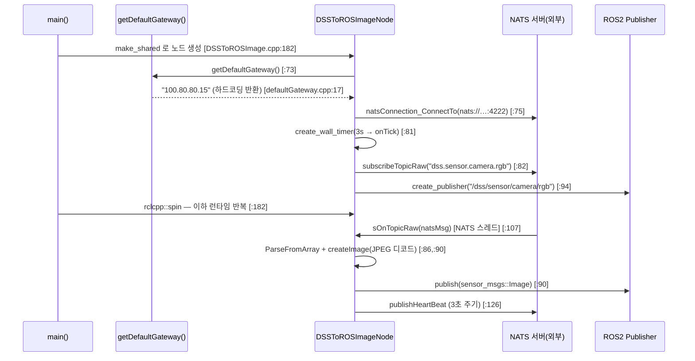
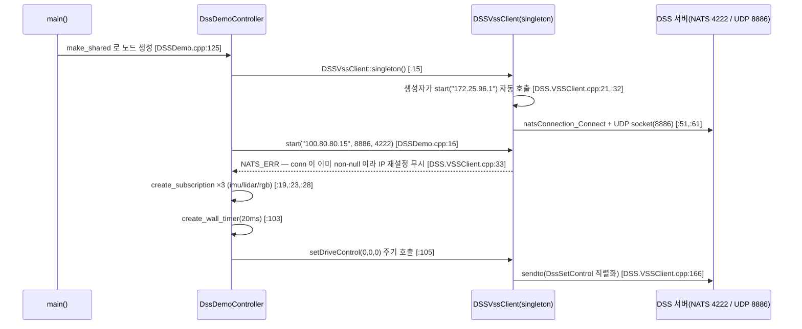

## 2026-08-15 22:55 (KST) — dss_ros2_bridge 패키지 구조

### 분석 범위

- 대상: `src/dss_ros2_bridge` (ROS 2 Humble, `ament_cmake` 패키지 · 실행 타깃 10개)
- 산출물 분기: **둘 다** — ① 파일 의존 그래프 + ② 클래스 관계도 + ③ 시퀀스 다이어그램
- 코드 상태: 저장소가 git 이 아니므로(`git rev-parse` 실패) **파일 내용 SHA256** 으로 버전을 고정한다.
- 제외: `src/dss.pb.h`(8,164줄) · `src/dss.pb.cc`(271KB) 의 **내부 구조** — protoc 생성물이라 노드로만 포함하고 내부는 분석하지 않는다. 원본 정의는 `proto/dss.proto`.
- 결함·품질 판정은 본 문서 범위 밖이다 → `docs/code_review/dss_ros2_bridge/` 소관.

#### 코드 버전 (SHA256, 비-git)

| 파일 | SHA256 (앞 16자리) |
| --- | --- |
| src/DSSToROSImage.cpp | `7486c1cb00a1a1e9` |
| src/DSSToROSStereoCameraColor.cpp | `995575f5b8f92222` |
| src/DSSToROSStereoCameraDepth.cpp | `6d1276cffb4bc0b5` |
| src/DSSToROSStereoCameraInfra1.cpp | `8f44af9b7a31499c` |
| src/DSSToROSStereoCameraInfra2.cpp | `9a55b60bf921af59` |
| src/DSSToROSIMU.cpp | `394728fc462c0451` |
| src/DSSToROSPointCloud.cpp | `e185ffca2e3bdf8c` |
| src/DSSToROSGps.cpp | `ffc2a18ed3f2c9a8` |
| src/DSSToROSClock.cpp | `d0d42c35a7396c59` |
| src/DSSDemo.cpp | `aca8eab59867a3ba` |
| src/DSS.VSSClient.cpp | `a6e7796ecb16cf26` |
| src/DSS.VSSClient.h | `7ce386ba4e65ef0b` |
| src/defaultGateway.cpp | `7fc807a40ad4782c` |
| src/defaultGateway.h | `8f995414b6c5f26c` |
| src/dss.pb.h | `6388f0ac9841ede9` |
| CMakeLists.txt | `7c2123d2233f594c` |
| package.xml | `a7922201a5cf5e3a` |
| launch/launch.py | `30d0ee6ecc8042f7` |
| launch/demo.py | `b0354146f725da2f` |
| msg/DssControl.msg | `cf474df7b4a24894` |
| proto/dss.proto | `48906766307ba1b1` |

---

### ① 파일 의존 그래프

C++ 번역단위 간 `#include` 관계만 그린다(rule 7 — 외부 라이브러리 `rclcpp`·`nats`·`opencv`·`nlohmann` 제외). 빌드·기동 구성은 아래 [보조표](#보조표--빌드기동-구성)에 따로 둔다.

동반 drawio: [`2026-08-15-file-graph.drawio`](2026-08-15-file-graph.drawio)

```mermaid
flowchart TB
    subgraph 브리지_노드_소스["브리지 노드 소스 (9)"]
        img["DSSToROSImage.cpp"]
        col["DSSToROSStereoCameraColor.cpp"]
        dep["DSSToROSStereoCameraDepth.cpp"]
        if1["DSSToROSStereoCameraInfra1.cpp"]
        if2["DSSToROSStereoCameraInfra2.cpp"]
        imu["DSSToROSIMU.cpp"]
        pcd["DSSToROSPointCloud.cpp"]
        gps["DSSToROSGps.cpp"]
        clk["DSSToROSClock.cpp"]
    end
    subgraph 공용_데모_소스["공용 / 데모 소스 (4)"]
        gw["defaultGateway.cpp"]
        vss["DSS.VSSClient.cpp"]
        demo["DSSDemo.cpp"]
        pbcc["dss.pb.cc"]
    end
    subgraph 헤더["헤더 (3)"]
        pbh["dss.pb.h"]
        gwh["defaultGateway.h"]
        vssh["DSS.VSSClient.h"]
    end

    img --> pbh
    img --> gwh
    col --> pbh
    col --> gwh
    dep --> pbh
    dep --> gwh
    if1 --> pbh
    if1 --> gwh
    if2 --> pbh
    if2 --> gwh
    imu --> pbh
    imu --> gwh
    pcd --> pbh
    pcd --> gwh
    gps --> pbh
    gps --> gwh
    clk --> pbh
    clk --> gwh
    demo --> vssh
    vss --> vssh
    vss --> pbh
    gw --> gwh
    pbcc --> pbh
```

**읽는 법**: 9개 브리지 소스가 예외 없이 같은 헤더 2개(`dss.pb.h`, `defaultGateway.h`)만 공유하고, 브리지끼리는 서로를 전혀 참조하지 않는다. `DSSDemo.cpp` 만 `DSS.VSSClient.h` 쪽 계열이며 `dss.pb.h` 를 직접 include 하지 않는다(그럼에도 CMake 는 `dss.pb.cc` 를 링크한다 — 보조표 참조).

---

### ② 클래스 관계도

동반 drawio: [`2026-08-15-class.drawio`](2026-08-15-class.drawio)

`NatsClient` 와 `TopicCtx` 는 **공유 타입이 아니다** — 9개 브리지 소스가 각자 파일 스코프에 동일한 정의를 따로 두고 있어 타입으로는 9개가 서로 다르다. 따라서 접미사로 구분해 표기한다(`_Img`=Image, `_Col`=StereoColor, `_Dep`=StereoDepth, `_If1`=Infra1, `_If2`=Infra2, `_Imu`=IMU, `_Pcd`=PointCloud, `_Gps`=Gps, `_Clk`=Clock).

```mermaid
classDiagram
    class Node { <<external>> }
    Node <|-- DSSToROSImageNode
    Node <|-- DSSToROSStereoCameraColorNode
    Node <|-- DSSToROSStereoCameraDepthNode
    Node <|-- DSSToROSStereoCameraInfra1Node
    Node <|-- DSSToROSStereoCameraInfra2Node
    Node <|-- DSSToROSIMUNode
    Node <|-- DSSToROSPointCloudNode
    Node <|-- DSSToROSGpsNode
    Node <|-- DSSToROSClockNode
    Node <|-- DssDemoController

    DSSToROSImageNode *-- NatsClient_Img
    DSSToROSImageNode *-- TopicCtx_Img
    DSSToROSStereoCameraColorNode *-- NatsClient_Col
    DSSToROSStereoCameraColorNode *-- TopicCtx_Col
    DSSToROSStereoCameraDepthNode *-- NatsClient_Dep
    DSSToROSStereoCameraDepthNode *-- TopicCtx_Dep
    DSSToROSStereoCameraInfra1Node *-- NatsClient_If1
    DSSToROSStereoCameraInfra1Node *-- TopicCtx_If1
    DSSToROSStereoCameraInfra2Node *-- NatsClient_If2
    DSSToROSStereoCameraInfra2Node *-- TopicCtx_If2
    DSSToROSIMUNode *-- NatsClient_Imu
    DSSToROSIMUNode *-- TopicCtx_Imu
    DSSToROSPointCloudNode *-- NatsClient_Pcd
    DSSToROSPointCloudNode *-- TopicCtx_Pcd
    DSSToROSGpsNode *-- NatsClient_Gps
    DSSToROSGpsNode *-- TopicCtx_Gps
    DSSToROSClockNode *-- NatsClient_Clk
    DSSToROSClockNode *-- TopicCtx_Clk

    DSSToROSImageNode ..> dss_DSSImage
    DSSToROSStereoCameraColorNode ..> dss_DSSImage
    DSSToROSStereoCameraDepthNode ..> dss_DSSImage
    DSSToROSStereoCameraInfra1Node ..> dss_DSSImage
    DSSToROSStereoCameraInfra2Node ..> dss_DSSImage
    DSSToROSIMUNode ..> dss_DSSIMU
    DSSToROSPointCloudNode ..> dss_DssLidarPointCloud
    DSSToROSGpsNode ..> dss_DSSGPS
    DSSToROSClockNode ..> dss_DssOneFrameFixedRateResult
    DssDemoController ..> DSSVssClient
    DSSVssClient ..> dss_DssSetControl
```

> mermaid 표기 주의: `Node` = `rclcpp::Node`(외부 기반 클래스, rule 7 예외로 표기), `dss_XXX` = `dss::XXX`(mermaid 식별자에 `::` 를 쓸 수 없어 치환). drawio 에는 원래 이름 그대로 들어 있다.

**읽는 법**: 10개 클래스 전부가 `rclcpp::Node` 를 직접 상속하는 1단 평면 구조다. 브리지 노드 사이에 공통 기반 클래스가 없어, 9개 클래스가 같은 골격(NATS 연결 → 구독 → protobuf 파싱 → ROS2 발행 → heartbeat)을 각자 복제해 갖는다. 제어 계열만 `DSSVssClient` 싱글톤을 경유한다.

---

### ③ 시퀀스 다이어그램

동반 drawio: [`2026-08-15-sequence.drawio`](2026-08-15-sequence.drawio)

진입점이 10개지만 그중 9개(브리지 노드)는 골격이 동일하므로 대표 1개로 그리고, 성격이 다른 제어 경로를 따로 그린다.

#### 시나리오 A — 센서 브리지 기동·수신·발행 (`DSSToROSImageNode` 대표)

나머지 8개 브리지 노드는 구독 subject·발행 토픽·메시지 타입·heartbeat subject만 다르고 호출 순서는 동일하다([토픽 매핑표](#보조표--natsros2-토픽-매핑-런타임-연결) 참조).

#### 시나리오 B — 제어 경로 (`DssDemoController` → DSS 서버 UDP)

> 6번 메시지는 **연결 관계의 사실**로만 기록한다(호출 결과가 반영되지 않는 경로가 존재함). 이것이 결함인지의 판정은 `code_review` 소관.

---

### ④ 연결 관계표

①·② 의 모든 화살표 62개를 전수 나열한다(③ 시퀀스의 호출은 ② 에 이미 반영되어 중복 기재하지 않음). 경로는 저장소 루트 기준 `src/dss_ros2_bridge/` 이하를 생략했다.

| # | source | → | target | 관계 종류 | 위치 |
|---|--------|---|--------|----------|------|
| 1 | DSSToROSImage.cpp | → | dss.pb.h | include | src/DSSToROSImage.cpp:5 |
| 2 | DSSToROSImage.cpp | → | defaultGateway.h | include | src/DSSToROSImage.cpp:6 |
| 3 | DSSToROSStereoCameraColor.cpp | → | dss.pb.h | include | src/DSSToROSStereoCameraColor.cpp:5 |
| 4 | DSSToROSStereoCameraColor.cpp | → | defaultGateway.h | include | src/DSSToROSStereoCameraColor.cpp:6 |
| 5 | DSSToROSStereoCameraDepth.cpp | → | dss.pb.h | include | src/DSSToROSStereoCameraDepth.cpp:5 |
| 6 | DSSToROSStereoCameraDepth.cpp | → | defaultGateway.h | include | src/DSSToROSStereoCameraDepth.cpp:6 |
| 7 | DSSToROSStereoCameraInfra1.cpp | → | dss.pb.h | include | src/DSSToROSStereoCameraInfra1.cpp:5 |
| 8 | DSSToROSStereoCameraInfra1.cpp | → | defaultGateway.h | include | src/DSSToROSStereoCameraInfra1.cpp:6 |
| 9 | DSSToROSStereoCameraInfra2.cpp | → | dss.pb.h | include | src/DSSToROSStereoCameraInfra2.cpp:5 |
| 10 | DSSToROSStereoCameraInfra2.cpp | → | defaultGateway.h | include | src/DSSToROSStereoCameraInfra2.cpp:6 |
| 11 | DSSToROSIMU.cpp | → | dss.pb.h | include | src/DSSToROSIMU.cpp:12 |
| 12 | DSSToROSIMU.cpp | → | defaultGateway.h | include | src/DSSToROSIMU.cpp:13 |
| 13 | DSSToROSPointCloud.cpp | → | dss.pb.h | include | src/DSSToROSPointCloud.cpp:5 |
| 14 | DSSToROSPointCloud.cpp | → | defaultGateway.h | include | src/DSSToROSPointCloud.cpp:6 |
| 15 | DSSToROSGps.cpp | → | dss.pb.h | include | src/DSSToROSGps.cpp:8 |
| 16 | DSSToROSGps.cpp | → | defaultGateway.h | include | src/DSSToROSGps.cpp:9 |
| 17 | DSSToROSClock.cpp | → | dss.pb.h | include | src/DSSToROSClock.cpp:7 |
| 18 | DSSToROSClock.cpp | → | defaultGateway.h | include | src/DSSToROSClock.cpp:8 |
| 19 | DSSDemo.cpp | → | DSS.VSSClient.h | include | src/DSSDemo.cpp:1 |
| 20 | DSS.VSSClient.cpp | → | DSS.VSSClient.h | include | src/DSS.VSSClient.cpp:4 |
| 21 | DSS.VSSClient.cpp | → | dss.pb.h | include | src/DSS.VSSClient.cpp:5 |
| 22 | defaultGateway.cpp | → | defaultGateway.h | include | src/defaultGateway.cpp:1 |
| 23 | dss.pb.cc | → | dss.pb.h | include | src/dss.pb.cc:4 |
| 24 | DSSToROSImageNode | → | rclcpp::Node | inherit | src/DSSToROSImage.cpp:18 |
| 25 | DSSToROSStereoCameraColorNode | → | rclcpp::Node | inherit | src/DSSToROSStereoCameraColor.cpp:18 |
| 26 | DSSToROSStereoCameraDepthNode | → | rclcpp::Node | inherit | src/DSSToROSStereoCameraDepth.cpp:18 |
| 27 | DSSToROSStereoCameraInfra1Node | → | rclcpp::Node | inherit | src/DSSToROSStereoCameraInfra1.cpp:18 |
| 28 | DSSToROSStereoCameraInfra2Node | → | rclcpp::Node | inherit | src/DSSToROSStereoCameraInfra2.cpp:18 |
| 29 | DSSToROSIMUNode | → | rclcpp::Node | inherit | src/DSSToROSIMU.cpp:26 |
| 30 | DSSToROSPointCloudNode | → | rclcpp::Node | inherit | src/DSSToROSPointCloud.cpp:21 |
| 31 | DSSToROSGpsNode | → | rclcpp::Node | inherit | src/DSSToROSGps.cpp:22 |
| 32 | DSSToROSClockNode | → | rclcpp::Node | inherit | src/DSSToROSClock.cpp:21 |
| 33 | DssDemoController | → | rclcpp::Node | inherit | src/DSSDemo.cpp:7 |
| 34 | DSSToROSImageNode | → | NatsClient_Img | compose | src/DSSToROSImage.cpp:24 |
| 35 | DSSToROSStereoCameraColorNode | → | NatsClient_Col | compose | src/DSSToROSStereoCameraColor.cpp:24 |
| 36 | DSSToROSStereoCameraDepthNode | → | NatsClient_Dep | compose | src/DSSToROSStereoCameraDepth.cpp:24 |
| 37 | DSSToROSStereoCameraInfra1Node | → | NatsClient_If1 | compose | src/DSSToROSStereoCameraInfra1.cpp:24 |
| 38 | DSSToROSStereoCameraInfra2Node | → | NatsClient_If2 | compose | src/DSSToROSStereoCameraInfra2.cpp:24 |
| 39 | DSSToROSIMUNode | → | NatsClient_Imu | compose | src/DSSToROSIMU.cpp:33 |
| 40 | DSSToROSPointCloudNode | → | NatsClient_Pcd | compose | src/DSSToROSPointCloud.cpp:28 |
| 41 | DSSToROSGpsNode | → | NatsClient_Gps | compose | src/DSSToROSGps.cpp:29 |
| 42 | DSSToROSClockNode | → | NatsClient_Clk | compose | src/DSSToROSClock.cpp:28 |
| 43 | DSSToROSImageNode | → | TopicCtx_Img | compose | src/DSSToROSImage.cpp:26 |
| 44 | DSSToROSStereoCameraColorNode | → | TopicCtx_Col | compose | src/DSSToROSStereoCameraColor.cpp:26 |
| 45 | DSSToROSStereoCameraDepthNode | → | TopicCtx_Dep | compose | src/DSSToROSStereoCameraDepth.cpp:26 |
| 46 | DSSToROSStereoCameraInfra1Node | → | TopicCtx_If1 | compose | src/DSSToROSStereoCameraInfra1.cpp:26 |
| 47 | DSSToROSStereoCameraInfra2Node | → | TopicCtx_If2 | compose | src/DSSToROSStereoCameraInfra2.cpp:26 |
| 48 | DSSToROSIMUNode | → | TopicCtx_Imu | compose | src/DSSToROSIMU.cpp:37 |
| 49 | DSSToROSPointCloudNode | → | TopicCtx_Pcd | compose | src/DSSToROSPointCloud.cpp:33 |
| 50 | DSSToROSGpsNode | → | TopicCtx_Gps | compose | src/DSSToROSGps.cpp:34 |
| 51 | DSSToROSClockNode | → | TopicCtx_Clk | compose | src/DSSToROSClock.cpp:33 |
| 52 | DSSToROSImageNode | → | dss::DSSImage | depend | src/DSSToROSImage.cpp:30 |
| 53 | DSSToROSStereoCameraColorNode | → | dss::DSSImage | depend | src/DSSToROSStereoCameraColor.cpp:30 |
| 54 | DSSToROSStereoCameraDepthNode | → | dss::DSSImage | depend | src/DSSToROSStereoCameraDepth.cpp:30 |
| 55 | DSSToROSStereoCameraInfra1Node | → | dss::DSSImage | depend | src/DSSToROSStereoCameraInfra1.cpp:30 |
| 56 | DSSToROSStereoCameraInfra2Node | → | dss::DSSImage | depend | src/DSSToROSStereoCameraInfra2.cpp:30 |
| 57 | DSSToROSIMUNode | → | dss::DSSIMU | depend | src/DSSToROSIMU.cpp:41 |
| 58 | DSSToROSPointCloudNode | → | dss::DssLidarPointCloud | depend | src/DSSToROSPointCloud.cpp:38 |
| 59 | DSSToROSGpsNode | → | dss::DSSGPS | depend | src/DSSToROSGps.cpp:38 |
| 60 | DSSToROSClockNode | → | dss::DssOneFrameFixedRateResult | depend | src/DSSToROSClock.cpp:40 |
| 61 | DssDemoController | → | DSSVssClient | depend | src/DSSDemo.cpp:15 |
| 62 | DSSVssClient | → | dss::DssSetControl | depend | src/DSS.VSSClient.cpp:156 |

---

### ⑤ 구조 관찰 (사실만)

- **순환 의존:** 순환 없음. ① 은 `.cpp → .h` 단방향 DAG(Directed Acyclic Graph) 이고, ② 의 상속·구성·의존도 모두 단방향이다.
- **고립 노드:** ① 그래프(C++ 번역단위) 범위 안에서는 고립 없음. 범위 밖에서 코드 연결이 0인 것 — `msg/DssControl.msg`: `rosidl_generate_interfaces` 로 타입은 생성되지만 `src/`·`launch/` 어디서도 참조되지 않는다(grep 실측 0건).
- **진입점:** `main()` 10개 — 실행 타깃 1개당 1개.
  `DSSToROSImage.cpp:179` · `DSSToROSStereoCameraColor.cpp:179` · `DSSToROSStereoCameraDepth.cpp:180` · `DSSToROSStereoCameraInfra1.cpp:179` · `DSSToROSStereoCameraInfra2.cpp:179` · `DSSToROSIMU.cpp:193` · `DSSToROSPointCloud.cpp:380` · `DSSToROSGps.cpp:182` · `DSSToROSClock.cpp:166` · `DSSDemo.cpp:122`
- **fan-in 상위**: `dss.pb.h` 11 · `defaultGateway.h` 10 · `DSS.VSSClient.h` 2 (② 기준으로는 `rclcpp::Node` 10)
- **fan-out**: 브리지 소스 9개가 각각 2(균일). 최대 fan-out은 `DSS.VSSClient.cpp` 2.
- **골격 반복**: 9개 브리지 소스가 `NatsClient` 구조체 · `TopicCtx` 중첩 구조체 · `sOnTopicRaw` · `subscribeTopicRaw` · `publishHeartBeat` · `getCurrentTimeISO8601` · `MAX_SUBS(64)` 를 **각 파일에 따로 정의**한다. 공유 헤더로 추출된 것은 `getDefaultGateway()` 하나뿐이다.
- **완전 중복 파일군**: 이미지 계열 5개(`Image`, `StereoColor`, `StereoDepth`, `Infra1`, `Infra2`)는 클래스명·NATS subject·ROS 토픽·heartbeat subject 외에는 완전히 동일하다(`diff` 실측 — 이름 치환 후 `Color` ↔ `Infra1` 차이는 heartbeat subject 표기 1줄뿐).
- **include 와 링크의 불일치**: `DSSDemo.cpp` 는 `dss.pb.h`·`defaultGateway.h` 를 include 하지 않지만 `CMakeLists.txt:140` 은 `dss.pb.cc`·`defaultGateway.cpp` 를 `DSSDemoNode` 타깃에 링크한다(간접 경유: `DSS.VSSClient.cpp` → `dss.pb.h`).

---

### 보조표 — 빌드·기동 구성

`#include` 가 아니라 **빌드 타깃 구성**과 **launch 기동** 관계다. 관계 종류 어휘(rule 3) 밖이므로 ①·④ 의 1:1 계약 밖에 둔다.

| # | 실행 타깃 | 구성 소스 | launch 등재 | 근거 |
|---|-----------|-----------|-------------|------|
| 1 | DSSToROSImageNode | DSSToROSImage.cpp + dss.pb.cc + defaultGateway.cpp | launch.py (name=Image) | CMakeLists.txt:45 / launch.py:18 |
| 2 | DSSToROSStereoCameraColorNode | DSSToROSStereoCameraColor.cpp + 〃 | launch.py (StereoColor) | CMakeLists.txt:55 / launch.py:28 |
| 3 | DSSToROSStereoCameraDepthNode | DSSToROSStereoCameraDepth.cpp + 〃 | launch.py (StereoDepth) | CMakeLists.txt:65 / launch.py:37 |
| 4 | DSSToROSStereoCameraInfra1Node | DSSToROSStereoCameraInfra1.cpp + 〃 | launch.py (StereoInfra1) | CMakeLists.txt:77 / launch.py:46 |
| 5 | DSSToROSStereoCameraInfra2Node | DSSToROSStereoCameraInfra2.cpp + 〃 | launch.py (StereoInfra2) | CMakeLists.txt:87 / launch.py:55 |
| 6 | DSSToROSPointCloudNode | DSSToROSPointCloud.cpp + 〃 | launch.py (PointCloud) | CMakeLists.txt:101 / launch.py:73 |
| 7 | DSSToROSIMUNode | DSSToROSIMU.cpp + 〃 | launch.py (IMU) | CMakeLists.txt:110 / launch.py:64 |
| 8 | DSSToROSClockNode | DSSToROSClock.cpp + 〃 | launch.py (Clock) | CMakeLists.txt:120 / launch.py:91 |
| 9 | DSSToROSGpsNode | DSSToROSGps.cpp + 〃 | launch.py (GPS) | CMakeLists.txt:130 / launch.py:82 |
| 10 | DSSDemoNode | DSSDemo.cpp + dss.pb.cc + DSS.VSSClient.cpp + defaultGateway.cpp | demo.py (Demo) · launch.py 에서는 주석 처리 | CMakeLists.txt:140 / demo.py:17 · launch.py:104-110 |

`DSS.VSSClient.cpp` 는 **`DSSDemoNode` 타깃에만** 링크된다 — 9개 브리지 노드는 VSS 클라이언트를 전혀 쓰지 않는다.

### 보조표 — NATS↔ROS2 토픽 매핑 (런타임 연결)

파일·클래스 연결이 아니라 **프로세스 간 런타임 연결**이다. 브리지의 실제 기능이 여기에 있어 구조 이해에 필요하다.

| # | 노드 | 구독 NATS subject | 발행 ROS2 토픽 | ROS 메시지 타입 | heartbeat subject |
|---|------|-------------------|----------------|-----------------|-------------------|
| 1 | DSSToROSImageNode | dss.sensor.camera.rgb | /dss/sensor/camera/rgb | sensor_msgs/Image | dss.dssToROSImage.heartBeat |
| 2 | DSSToROSStereoCameraColorNode | dss.sensor.camera.stereo.color | /dss/sensor/camera/color/image_raw | sensor_msgs/Image | dss.dssToROSStereoCameraColor.heartBeat |
| 3 | DSSToROSStereoCameraDepthNode | dss.sensor.camera.stereo.depth | /dss/sensor/camera/depth/image_raw | sensor_msgs/Image | dss.dssToROSStereoCameraDepth.heartBeat |
| 4 | DSSToROSStereoCameraInfra1Node | dss.sensor.camera.stereo.infra1 | /dss/sensor/camera/infra1/image_raw | sensor_msgs/Image | dss.DSSToROSStereoCameraInfra1Node.heartBeat |
| 5 | DSSToROSStereoCameraInfra2Node | dss.sensor.camera.stereo.infra2 | /dss/sensor/camera/infra2/image_raw | sensor_msgs/Image | dss.DSSToROSStereoCameraInfra2Node.heartBeat |
| 6 | DSSToROSIMUNode | dss.sensor.imu | /dss/sensor/imu | sensor_msgs/Imu | dss.dssToROSImu.heartBeat |
| 7 | DSSToROSPointCloudNode | dss.sensor.lidar | /dss/sensor/lidar3d | sensor_msgs/PointCloud2 | dss.dssToROSPointCloud.heartBeat |
| 8 | DSSToROSGpsNode | dss.sensor.gps | /dss/sensor/gps/fix | sensor_msgs/NavSatFix | dss.dssToROSGps.heartBeat |
| 9 | DSSToROSClockNode | dss.simTime.clock | /clock | rosgraph_msgs/Clock | dss.dssToROSClock.heartBeat |
| 10 | DSSDemoNode | (구독 없음) | (발행 없음) · UDP 8886 으로 DssSetControl 송신 | — | (없음) |

`DSSDemoNode` 가 **구독**하는 ROS2 토픽: `/dss/sensor/imu`, `/dss/sensor/lidar`, `/dss/sensor/camera/rgb` (DSSDemo.cpp:20,:24,:29).

---

### 다이어그램 검증 기록

| 다이어그램 | 파일 | Layer A 린트 | Layer B 렌더 검토 |
|---|---|---|---|
| ① 파일 의존 그래프 | 2026-08-15-file-graph.drawio | ✅ 박스 17 · 엣지 23 · L1~L11 전부 통과 | ✅ 통과 (`--export` 렌더 육안 검토) |
| ② 클래스 관계도 | 2026-08-15-class.drawio | ✅ 박스 37 · 엣지 39 · L1~L11 전부 통과 | ✅ 통과 |
| ③ 시퀀스 | 2026-08-15-sequence.drawio | ⚠ 결함 0 · L7 경고 2건 | ✅ 통과 (1차 검토에서 결함 3종 발견 → 수선 후 재통과) |

- ③ L7 경고 2건은 메시지 7·11(`DSSToROSImageNode` → `ROS2 Publisher`)이 중간 참여자 `NATS 서버` lifeline 을 가로지르는 것이다. 참여자를 일렬로 놓는 시퀀스 다이어그램에서 중간 lifeline 교차는 표준 표기이며, 참여자 순서를 바꿔도 교차 2건 이하로는 줄지 않는다(노드가 4개 참여자와 인접해야 하는데 선형 배치에서 인접은 최대 2). 결함이 아니라 표기 특성으로 기록한다.
- ③ 1차 렌더에서 발견해 수선한 결함: (a) 엣지 라벨이 화살표 선 위에 겹쳐 선이 끊겨 보임 → `verticalAlign=bottom;labelBackgroundColor=none` (b) 참여자 간격 180px 이 라벨보다 좁아 라벨이 lifeline 침범 → 간격 420px 로 확대 (c) self 메시지 루프가 라벨에 가려 보이지 않음 → 루프 크기 확대 + 라벨 좌측 정렬.
- 렌더 PNG: `experiments/capture/` (`--export` 방식, `xvfb` 불요 — DISPLAY=:0 가용 확인).
- ①② 는 흐름이 위·아래 양방향(상속은 위, 구성·의존은 아래)이다. 한 방향 통일 대신 **엣지 교차 0** 을 택한 배치이며, 화살표는 모두 "의존하는 쪽 → 의존되는 쪽"으로 일관된다(각 도면 범례에 명시).

---
