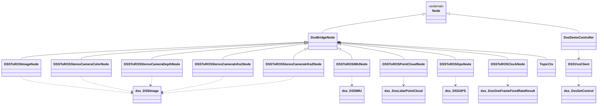
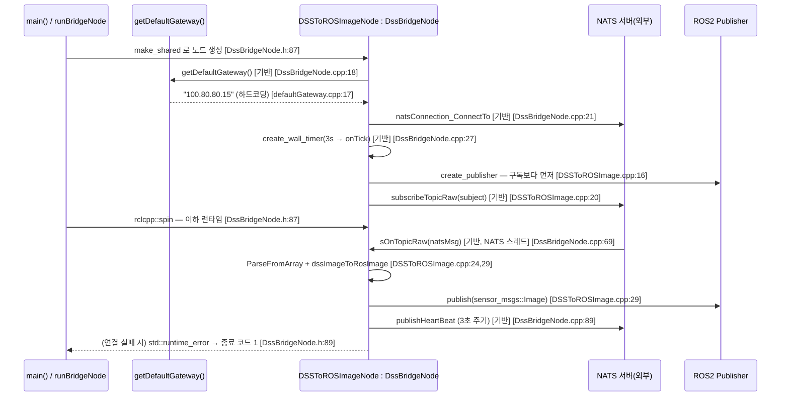
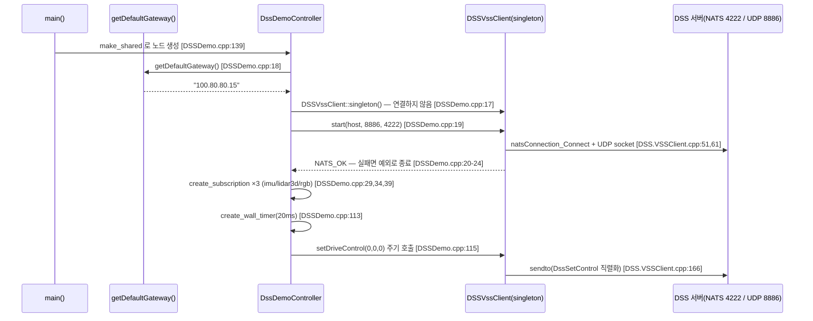

## 2026-08-16 08:40 (KST) — dss_ros2_bridge 패키지 구조 (기반 클래스 도입 후 전면 재작성)

### 분석 범위

- 대상: `src/dss_ros2_bridge` (ROS 2 Humble, `ament_cmake` 패키지 · 실행 타깃 10개)
- 산출물 분기: **둘 다** — ① 파일 의존 그래프 + ② 클래스 관계도 + ③ 시퀀스 다이어그램
- [2026-08-15 스냅샷](2026-08-15.md) 을 **대체**한다. 그 사이 브리지 골격이 `DssBridgeNode` 기반 클래스로 추출되어 클래스 계층과 파일 구성이 모두 바뀌었다([ADR](../../adr/2026-08-16-bridge-base-class.md)).
- 코드 상태: 비-git → **파일 내용 SHA256** 으로 고정
- 제외: `src/dss.pb.h`·`src/dss.pb.cc` 의 **내부 구조**(protoc 생성물 — 노드로만 포함). 원본은 `proto/dss.proto`.
- 결함·품질 판정은 범위 밖 → `docs/code_review/dss_ros2_bridge/` 소관.

#### 2026-08-15 대비 무엇이 달라졌나

| 항목 | 2026-08-15 | 2026-08-16 |
| --- | --- | --- |
| 클래스 계층 | 10개 클래스가 `rclcpp::Node` 직접 상속 (1단 평면) | 브리지 9개가 `rclcpp::Node` → **`DssBridgeNode`** → 각 노드 (2단) |
| C++ 번역단위 | 16 | **20** (`DssBridgeNode.{h,cpp}` · `DssImageConvert.{h,cpp}` 신설) |
| 중복 골격 | `NatsClient`·`TopicCtx`·`sOnTopicRaw`·`subscribeTopicRaw`·`publishHeartBeat`·`getCurrentTimeISO8601`·`onTick` 각 **9벌** | 각 **1벌** (`DssBridgeNode`) |
| `createImage` | 5벌 | 1벌 (`dssImageToRosImage`) |
| `main` | 10벌 | 1벌 템플릿 (`runBridgeNode<NodeT>`) + 데모 1벌 |
| ② 클래스 엣지 수 | 39 | **23** |

#### 코드 버전 (SHA256 앞 16자리, 비-git)

| 파일 | 해시 | 파일 | 해시 |
| --- | --- | --- | --- |
| src/DssBridgeNode.h | `99c75bfa46dae31f` | src/DSSToROSIMU.cpp | `f65ff199866c876b` |
| src/DssBridgeNode.cpp | `aec2d2914eed9ac8` | src/DSSToROSPointCloud.cpp | `585ebda05259bc91` |
| src/DssImageConvert.h | `f1c2bbd4320cabcd` | src/DSSToROSGps.cpp | `edd77594e1ceb450` |
| src/DssImageConvert.cpp | `fe0dd5563df6af30` | src/DSSToROSClock.cpp | `31b6f9cdb8dfb626` |
| src/DSSToROSImage.cpp | `fddb0670f7cfe5b5` | src/DSSDemo.cpp | `79e70df0ccdb80a4` |
| src/DSSToROSStereoCameraColor.cpp | `32f4fa5d18c18de4` | src/DSS.VSSClient.h | `ee52f7875823c153` |
| src/DSSToROSStereoCameraDepth.cpp | `ef6819e531e5ec13` | src/DSS.VSSClient.cpp | `e59dd8b201e37b14` |
| src/DSSToROSStereoCameraInfra1.cpp | `f1c71242f45dbd2b` | src/defaultGateway.h | `8f995414b6c5f26c` |
| src/DSSToROSStereoCameraInfra2.cpp | `31c5ffd6ba5f7fac` | src/defaultGateway.cpp | `7fc807a40ad4782c` |
| CMakeLists.txt | `52a3c5755fdf4f22` | package.xml | `4d0e7ee490c07576` |

---

### ① 파일 의존 그래프

C++ 번역단위 간 `#include` 관계만 그린다(rule 7 — 외부 라이브러리 `rclcpp`·`nats`·`opencv`·`nlohmann` 제외). 빌드·기동 구성은 [보조표](#보조표--빌드기동-구성) 참조.

동반 drawio: [`2026-08-16-file-graph.drawio`](2026-08-16-file-graph.drawio)

```mermaid
flowchart TB
    subgraph 브리지_소스["브리지 노드 소스 (9)"]
        img["DSSToROSImage.cpp"]
        col["DSSToROSStereoCameraColor.cpp"]
        dep["DSSToROSStereoCameraDepth.cpp"]
        if1["DSSToROSStereoCameraInfra1.cpp"]
        if2["DSSToROSStereoCameraInfra2.cpp"]
        imu["DSSToROSIMU.cpp"]
        pcd["DSSToROSPointCloud.cpp"]
        gps["DSSToROSGps.cpp"]
        clk["DSSToROSClock.cpp"]
    end
    subgraph 공통_데모_소스["공통 / 데모 소스 (6)"]
        base["DssBridgeNode.cpp"]
        conv["DssImageConvert.cpp"]
        gw["defaultGateway.cpp"]
        demo["DSSDemo.cpp"]
        vss["DSS.VSSClient.cpp"]
        pbcc["dss.pb.cc"]
    end
    subgraph 헤더["헤더 (5)"]
        hbase["DssBridgeNode.h"]
        hconv["DssImageConvert.h"]
        hgw["defaultGateway.h"]
        hvss["DSS.VSSClient.h"]
        hpb["dss.pb.h"]
    end

    img --> hbase
    img --> hconv
    col --> hbase
    col --> hconv
    dep --> hbase
    dep --> hconv
    if1 --> hbase
    if1 --> hconv
    if2 --> hbase
    if2 --> hconv
    imu --> hbase
    imu --> hpb
    pcd --> hbase
    pcd --> hpb
    gps --> hbase
    gps --> hpb
    clk --> hbase
    clk --> hpb
    base --> hbase
    base --> hgw
    conv --> hconv
    gw --> hgw
    demo --> hvss
    demo --> hgw
    vss --> hvss
    vss --> hpb
    pbcc --> hpb
    hconv --> hpb
```

**읽는 법**: 9개 브리지 소스가 예외 없이 `DssBridgeNode.h` 하나에 모인다(fan-in 10). 이미지 계열 5개는 `dss.pb.h` 를 직접 include 하지 않고 `DssImageConvert.h` 를 통해 간접 의존한다 — protobuf 타입을 다루는 코드가 그 헤더 한 곳으로 모였기 때문이다. 브리지끼리는 서로를 전혀 참조하지 않는다.

---

### ② 클래스 관계도

동반 drawio: [`2026-08-16-class.drawio`](2026-08-16-class.drawio)

> mermaid 표기 주의: `Node` = `rclcpp::Node`(외부 기반 클래스, rule 7 예외로 표기), `TopicCtx` = `DssBridgeNode::TopicCtx`, `dss_XXX` = `dss::XXX`(mermaid 식별자에 `::` 사용 불가). drawio 에는 원래 이름 그대로 들어 있다.

**읽는 법**: 2026-08-15 의 1단 평면 구조가 2단이 되었다. 브리지 9개는 `DssBridgeNode` 에서 NATS 연결·구독·heartbeat 를 물려받고, 각자는 **퍼블리셔·구독 subject·변환 함수**만 갖는다. `DssDemoController` 는 브리지가 아니라 제어 송신 노드라 기반 클래스를 쓰지 않고 `rclcpp::Node` 를 직접 상속한다.

`dssImageToRosImage`(자유 함수)는 클래스가 아니라 ②에 노드가 없다 — 이미지 계열 5개 노드가 호출하며 그 연결은 ① 의 `DssImageConvert.h` 의존으로 나타난다.

---

### ③ 시퀀스 다이어그램

동반 drawio: [`2026-08-16-sequence.drawio`](2026-08-16-sequence.drawio)

진입점이 10개지만 그중 9개(브리지 노드)는 기반 클래스 덕에 골격이 **코드 수준에서도** 동일하므로 대표 1개로 그린다.

#### 시나리오 A — 센서 브리지 기동·수신·발행 (`DSSToROSImageNode` 대표)

`[기반]` 표시는 `DssBridgeNode` 가 수행하는 단계다.

나머지 8개 브리지 노드는 **구독 subject·발행 토픽·메시지 타입·변환 함수·heartbeat subject만** 다르다([토픽 매핑표](#보조표--natsros2-토픽-매핑-런타임-연결) 참조).

#### 시나리오 B — 제어 경로 (`DssDemoController` → DSS 서버 UDP)

---

### ④ 연결 관계표

①·② 의 모든 화살표 51개를 전수 나열한다(③ 시퀀스의 호출은 ② 에 반영되어 중복 기재하지 않음). 경로는 `src/dss_ros2_bridge/` 이하를 생략했다.

| # | source | → | target | 관계 종류 | 위치 |
|---|--------|---|--------|----------|------|
| 1 | DSSToROSImage.cpp | → | DssBridgeNode.h | include | src/DSSToROSImage.cpp:1 |
| 2 | DSSToROSImage.cpp | → | DssImageConvert.h | include | src/DSSToROSImage.cpp:2 |
| 3 | DSSToROSStereoCameraColor.cpp | → | DssBridgeNode.h | include | src/DSSToROSStereoCameraColor.cpp:1 |
| 4 | DSSToROSStereoCameraColor.cpp | → | DssImageConvert.h | include | src/DSSToROSStereoCameraColor.cpp:2 |
| 5 | DSSToROSStereoCameraDepth.cpp | → | DssBridgeNode.h | include | src/DSSToROSStereoCameraDepth.cpp:1 |
| 6 | DSSToROSStereoCameraDepth.cpp | → | DssImageConvert.h | include | src/DSSToROSStereoCameraDepth.cpp:2 |
| 7 | DSSToROSStereoCameraInfra1.cpp | → | DssBridgeNode.h | include | src/DSSToROSStereoCameraInfra1.cpp:1 |
| 8 | DSSToROSStereoCameraInfra1.cpp | → | DssImageConvert.h | include | src/DSSToROSStereoCameraInfra1.cpp:2 |
| 9 | DSSToROSStereoCameraInfra2.cpp | → | DssBridgeNode.h | include | src/DSSToROSStereoCameraInfra2.cpp:1 |
| 10 | DSSToROSStereoCameraInfra2.cpp | → | DssImageConvert.h | include | src/DSSToROSStereoCameraInfra2.cpp:2 |
| 11 | DSSToROSIMU.cpp | → | DssBridgeNode.h | include | src/DSSToROSIMU.cpp:1 |
| 12 | DSSToROSIMU.cpp | → | dss.pb.h | include | src/DSSToROSIMU.cpp:7 |
| 13 | DSSToROSPointCloud.cpp | → | DssBridgeNode.h | include | src/DSSToROSPointCloud.cpp:1 |
| 14 | DSSToROSPointCloud.cpp | → | dss.pb.h | include | src/DSSToROSPointCloud.cpp:9 |
| 15 | DSSToROSGps.cpp | → | DssBridgeNode.h | include | src/DSSToROSGps.cpp:1 |
| 16 | DSSToROSGps.cpp | → | dss.pb.h | include | src/DSSToROSGps.cpp:6 |
| 17 | DSSToROSClock.cpp | → | DssBridgeNode.h | include | src/DSSToROSClock.cpp:1 |
| 18 | DSSToROSClock.cpp | → | dss.pb.h | include | src/DSSToROSClock.cpp:5 |
| 19 | DssBridgeNode.cpp | → | DssBridgeNode.h | include | src/DssBridgeNode.cpp:1 |
| 20 | DssBridgeNode.cpp | → | defaultGateway.h | include | src/DssBridgeNode.cpp:2 |
| 21 | DssImageConvert.cpp | → | DssImageConvert.h | include | src/DssImageConvert.cpp:1 |
| 22 | DssImageConvert.h | → | dss.pb.h | include | src/DssImageConvert.h:6 |
| 23 | defaultGateway.cpp | → | defaultGateway.h | include | src/defaultGateway.cpp:1 |
| 24 | DSSDemo.cpp | → | DSS.VSSClient.h | include | src/DSSDemo.cpp:1 |
| 25 | DSSDemo.cpp | → | defaultGateway.h | include | src/DSSDemo.cpp:2 |
| 26 | DSS.VSSClient.cpp | → | DSS.VSSClient.h | include | src/DSS.VSSClient.cpp:4 |
| 27 | DSS.VSSClient.cpp | → | dss.pb.h | include | src/DSS.VSSClient.cpp:5 |
| 28 | dss.pb.cc | → | dss.pb.h | include | src/dss.pb.cc:4 |
| 29 | DssBridgeNode | → | rclcpp::Node | inherit | src/DssBridgeNode.h:19 |
| 30 | DssDemoController | → | rclcpp::Node | inherit | src/DSSDemo.cpp:9 |
| 31 | DSSToROSImageNode | → | DssBridgeNode | inherit | src/DSSToROSImage.cpp:6 |
| 32 | DSSToROSStereoCameraColorNode | → | DssBridgeNode | inherit | src/DSSToROSStereoCameraColor.cpp:6 |
| 33 | DSSToROSStereoCameraDepthNode | → | DssBridgeNode | inherit | src/DSSToROSStereoCameraDepth.cpp:6 |
| 34 | DSSToROSStereoCameraInfra1Node | → | DssBridgeNode | inherit | src/DSSToROSStereoCameraInfra1.cpp:6 |
| 35 | DSSToROSStereoCameraInfra2Node | → | DssBridgeNode | inherit | src/DSSToROSStereoCameraInfra2.cpp:6 |
| 36 | DSSToROSIMUNode | → | DssBridgeNode | inherit | src/DSSToROSIMU.cpp:9 |
| 37 | DSSToROSPointCloudNode | → | DssBridgeNode | inherit | src/DSSToROSPointCloud.cpp:11 |
| 38 | DSSToROSGpsNode | → | DssBridgeNode | inherit | src/DSSToROSGps.cpp:8 |
| 39 | DSSToROSClockNode | → | DssBridgeNode | inherit | src/DSSToROSClock.cpp:7 |
| 40 | DssBridgeNode | → | DssBridgeNode::TopicCtx | compose | src/DssBridgeNode.h:66 |
| 41 | DSSToROSImageNode | → | dss::DSSImage | depend | src/DSSToROSImage.cpp:24 |
| 42 | DSSToROSStereoCameraColorNode | → | dss::DSSImage | depend | src/DSSToROSStereoCameraColor.cpp:24 |
| 43 | DSSToROSStereoCameraDepthNode | → | dss::DSSImage | depend | src/DSSToROSStereoCameraDepth.cpp:24 |
| 44 | DSSToROSStereoCameraInfra1Node | → | dss::DSSImage | depend | src/DSSToROSStereoCameraInfra1.cpp:24 |
| 45 | DSSToROSStereoCameraInfra2Node | → | dss::DSSImage | depend | src/DSSToROSStereoCameraInfra2.cpp:24 |
| 46 | DSSToROSIMUNode | → | dss::DSSIMU | depend | src/DSSToROSIMU.cpp:19 |
| 47 | DSSToROSPointCloudNode | → | dss::DssLidarPointCloud | depend | src/DSSToROSPointCloud.cpp:23 |
| 48 | DSSToROSGpsNode | → | dss::DSSGPS | depend | src/DSSToROSGps.cpp:20 |
| 49 | DSSToROSClockNode | → | dss::DssOneFrameFixedRateResult | depend | src/DSSToROSClock.cpp:18 |
| 50 | DssDemoController | → | DSSVssClient | depend | src/DSSDemo.cpp:17 |
| 51 | DSSVssClient | → | dss::DssSetControl | depend | src/DSS.VSSClient.cpp:156 |

---

### ⑤ 구조 관찰 (사실만)

- **순환 의존:** 순환 없음. ① 은 `.cpp/.h → .h` 단방향 DAG(Directed Acyclic Graph) 이고(유일한 헤더→헤더 엣지 `DssImageConvert.h → dss.pb.h` 도 단방향), ② 의 상속·구성·의존도 모두 단방향이다.
- **고립 노드:** ① 그래프(C++ 번역단위) 범위 안에서는 고립 없음. 범위 밖에서 코드 연결이 0인 것 — `msg/DssControl.msg`: `rosidl_generate_interfaces` 로 타입은 생성되지만 `src/`·`launch/` 어디서도 참조되지 않는다(grep 실측 0건, 2026-08-15 이후 변동 없음).
- **진입점:** `main()` 10개 — 실행 타깃 1개당 1개. 브리지 9개는 `runBridgeNode<NodeT>()` 템플릿 한 줄로 위임한다.
  `DSSToROSImage.cpp:39` · `DSSToROSStereoCameraColor.cpp:39` · `DSSToROSStereoCameraDepth.cpp:39` · `DSSToROSStereoCameraInfra1.cpp:39` · `DSSToROSStereoCameraInfra2.cpp:39` · `DSSToROSIMU.cpp:112` · `DSSToROSPointCloud.cpp:126` · `DSSToROSGps.cpp:63` · `DSSToROSClock.cpp:51` · `DSSDemo.cpp:137`
- **fan-in 상위:** `dss.pb.h` 8 · `DssBridgeNode.h` 10 · `DssImageConvert.h` 6 · `defaultGateway.h` 3 · `DSS.VSSClient.h` 2. ② 기준으로는 `DssBridgeNode` 9(상속) · `rclcpp::Node` 2.
- **fan-out:** 브리지 소스 9개가 각각 2(균일). `DSSDemo.cpp`·`DssBridgeNode.cpp`·`DSS.VSSClient.cpp` 도 각 2.
- **골격 반복 해소:** 2026-08-15 에 기록한 "9벌 복제"가 사라졌다. `sOnTopicRaw`·`subscribeTopicRaw`·`publishHeartBeat`·`currentTimeIso8601`·`onTick`·`TopicCtx`·구독 한도 상수는 각각 **정의가 1곳**이다(grep 실측: `MAX_SUBS` 매크로 0파일, `struct NatsClient` 0파일, `sOnTopicRaw` 정의 1파일).
- **이미지 계열 5개 파일:** 각 41줄이며 클래스명·subject·토픽·heartbeat subject 4개 값만 다르다. 변환 로직은 `dssImageToRosImage` 1곳.
- **간접 의존 구조:** 이미지 계열 5개는 `dss.pb.h` 를 직접 include 하지 않는다(`DssImageConvert.h` 경유). protobuf 타입을 직접 다루는 번역단위는 IMU·PointCloud·Gps·Clock·`DSS.VSSClient.cpp`·`DssImageConvert.h` 6곳으로 줄었다.

---

### 보조표 — 빌드·기동 구성

`#include` 가 아니라 **빌드 타깃 구성**과 **launch 기동** 관계다. 관계 종류 어휘(rule 3) 밖이므로 ①·④ 의 1:1 계약 밖에 둔다. `CMakeLists.txt` 는 `add_dss_node()`·`add_bridge_node()` 함수로 공통 소스를 붙인다.

| # | 실행 타깃 | 노드 고유 소스 | 자동 추가 소스 | launch 등재 |
| --- | --- | --- | --- | --- |
| 1 | DSSToROSImageNode | DSSToROSImage.cpp + DssImageConvert.cpp | DssBridgeNode.cpp · dss.pb.cc · defaultGateway.cpp | launch.py (Image) |
| 2 | DSSToROSStereoCameraColorNode | DSSToROSStereoCameraColor.cpp + DssImageConvert.cpp | 〃 | launch.py (StereoColor) |
| 3 | DSSToROSStereoCameraDepthNode | DSSToROSStereoCameraDepth.cpp + DssImageConvert.cpp | 〃 | launch.py (StereoDepth) |
| 4 | DSSToROSStereoCameraInfra1Node | DSSToROSStereoCameraInfra1.cpp + DssImageConvert.cpp | 〃 | launch.py (StereoInfra1) |
| 5 | DSSToROSStereoCameraInfra2Node | DSSToROSStereoCameraInfra2.cpp + DssImageConvert.cpp | 〃 | launch.py (StereoInfra2) |
| 6 | DSSToROSPointCloudNode | DSSToROSPointCloud.cpp | 〃 | launch.py (PointCloud) |
| 7 | DSSToROSIMUNode | DSSToROSIMU.cpp | 〃 | launch.py (IMU) |
| 8 | DSSToROSGpsNode | DSSToROSGps.cpp | 〃 | launch.py (GPS) |
| 9 | DSSToROSClockNode | DSSToROSClock.cpp | 〃 | launch.py (Clock) |
| 10 | DSSDemoNode | DSSDemo.cpp + DSS.VSSClient.cpp | dss.pb.cc · defaultGateway.cpp (**DssBridgeNode.cpp 제외**) | demo.py (Demo) |

`DssBridgeNode.cpp` 는 브리지 9개 타깃에만, `DssImageConvert.cpp` 는 이미지 5개 타깃에만 들어간다. `DSS.VSSClient.cpp` 는 `DSSDemoNode` 에만 링크된다.

### 보조표 — NATS↔ROS2 토픽 매핑 (런타임 연결)

| # | 노드 | 구독 NATS subject | 발행 ROS2 토픽 | 메시지 타입 | 발행 QoS | heartbeat subject |
|---|------|-------------------|----------------|-------------|----------|-------------------|
| 1 | DSSToROSImageNode | dss.sensor.camera.rgb | /dss/sensor/camera/rgb | sensor_msgs/Image | RELIABLE·KeepLast(10) | dss.dssToROSImage.heartBeat |
| 2 | DSSToROSStereoCameraColorNode | dss.sensor.camera.stereo.color | /dss/sensor/camera/color/image_raw | sensor_msgs/Image | RELIABLE·KeepLast(10) | dss.dssToROSStereoCameraColor.heartBeat |
| 3 | DSSToROSStereoCameraDepthNode | dss.sensor.camera.stereo.depth | /dss/sensor/camera/depth/image_raw | sensor_msgs/Image | RELIABLE·KeepLast(10) | dss.dssToROSStereoCameraDepth.heartBeat |
| 4 | DSSToROSStereoCameraInfra1Node | dss.sensor.camera.stereo.infra1 | /dss/sensor/camera/infra1/image_raw | sensor_msgs/Image | RELIABLE·KeepLast(10) | dss.DSSToROSStereoCameraInfra1Node.heartBeat |
| 5 | DSSToROSStereoCameraInfra2Node | dss.sensor.camera.stereo.infra2 | /dss/sensor/camera/infra2/image_raw | sensor_msgs/Image | RELIABLE·KeepLast(10) | dss.DSSToROSStereoCameraInfra2Node.heartBeat |
| 6 | DSSToROSIMUNode | dss.sensor.imu | /dss/sensor/imu | sensor_msgs/Imu | SensorDataQoS | dss.dssToROSImu.heartBeat |
| 7 | DSSToROSPointCloudNode | dss.sensor.lidar | /dss/sensor/lidar3d | sensor_msgs/PointCloud2 | SensorDataQoS | dss.dssToROSPointCloud.heartBeat |
| 8 | DSSToROSGpsNode | dss.sensor.gps | /dss/sensor/gps/fix | sensor_msgs/NavSatFix | SensorDataQoS | dss.dssToROSGps.heartBeat |
| 9 | DSSToROSClockNode | dss.simTime.clock | /clock | rosgraph_msgs/Clock | ClockQoS | dss.dssToROSClock.heartBeat |
| 10 | DSSDemoNode | (없음) | (없음) · UDP 8886 으로 DssSetControl 송신 | — | — | (없음) |

`DSSDemoNode` 가 **구독**하는 ROS2 토픽: `/dss/sensor/imu`, `/dss/sensor/lidar3d`, `/dss/sensor/camera/rgb` (DSSDemo.cpp:29,34,39).

QoS 근거는 [ADR 2026-08-16 토픽 QoS](../../adr/2026-08-16-topic-qos.md), heartbeat subject 의 Infra1·Infra2 명명 불일치는 [코드 리뷰 Info #1](../../code_review/dss_ros2_bridge/2026-08-15.md) 참조(미해결).

---

### 다이어그램 검증 기록

| 다이어그램 | 파일 | Layer A 린트 | Layer B 렌더 검토 |
|---|---|---|---|
| ① 파일 의존 그래프 | 2026-08-16-file-graph.drawio | ⚠ 결함 0 · L7 경고 15건(**오탐**, 아래) | ✅ 통과 |
| ② 클래스 관계도 | 2026-08-16-class.drawio | ✅ 박스 21 · 엣지 23 · L1~L11 전부 통과 | ✅ 통과 |
| ③ 시퀀스 | 2026-08-16-sequence.drawio | ⚠ 결함 0 · L7 경고 2건 | ✅ 통과 |

- **① 의 L7 경고 15건은 오탐이다.** 소스행과 헤더행 사이 빈 구간(y=350)으로 수평 이동하도록 각 엣지에 waypoint 2개를 지정했는데, 린트의 경로 추정기가 `<Array as="points">` 를 반영하지 않고 "출발점에서 수직 → 도착 높이에서 수평" 으로 가정해 헤더행을 관통한다고 본다. `--export` 렌더에서는 수평 구간이 빈 띠를 지나며 **박스 관통이 하나도 없음을 육안 확인**했다. drawio 번들 문서가 밝힌 대로 "최종 진실은 Layer B 렌더" 다.
- **③ 의 L7 경고 2건**은 메시지 6·11(`DSSToROSImageNode` → `ROS2 Publisher`)이 중간 참여자 `NATS 서버` lifeline 을 가로지르는 것으로, 참여자를 일렬로 놓는 시퀀스 다이어그램의 표준 표기다.
- ①② 는 흐름이 위·아래 양방향(상속은 위, 구성·의존은 아래)이다. 한 방향 통일 대신 **엣지 교차 최소화**를 택한 배치이며, 화살표는 모두 "의존하는 쪽 → 의존되는 쪽" 으로 일관된다(각 도면 범례에 명시).
- 렌더 PNG: `experiments/capture/` (`--export` 방식).

---
